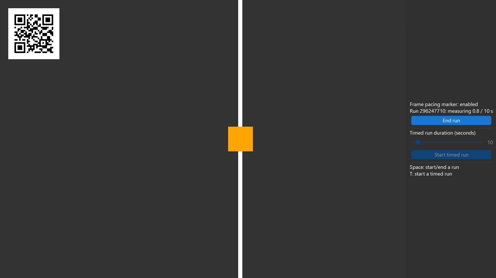

<!-- #AG_DEMOAPP_HEADER_BEGIN# -->
# FramePacing

<!-- #AG_DEMOAPP_HEADER_END# -->
<!-- #AG_BRIEF_BEGIN# -->
Shows how to control the [mb-framepacing](https://github.com/Unarmed1000/mb-framepacing) frame marker through the IFramePacingService.
<!-- #AG_BRIEF_END# -->

The host draws a QR frame marker (frame index + animation time) on top of every frame so a capture of the display output can be analysed
for animation error. Every app supports it through the `--FramePacing` command line arguments, this sample just enables it by default
and lets you control measured runs:

- **Space** or **Start run**: start an open ended run, press again to end it.
- **T** or **Start timed run**: start a run that ends by itself after the duration selected with the slider (1-120 seconds).

The moving bar and box are animated from the same animation time the marker reports, so any hitch is visible and measurable.

The sample code lives in [Shared/FramePacing](../../Shared/FramePacing) and only uses the API independent INativeBatch2D, so the
GLES2, GLES3 and Vulkan versions are identical.

See [Doc/FramePacing.md](../../../Doc/FramePacing.md) for details.

<!-- #AG_DEMOAPP_COMMANDLINE_ARGUMENTS_BEGIN# -->

Command line arguments':

Argument                          |Description                                                                                                                                                         |Source
----------------------------------|--------------------------------------------------------------------------------------------------------------------------------------------------------------------|-------------------------------------------------------------------------------------------------------
--ActualDpi \<arg>                |ActualDpi [x,y] Override the actual dpi reported by the native window                                                                                               |DemoHost
--DensityDpi \<arg>               |DensityDpi \<number> Override the density dpi reported by the native window                                                                                         |DemoHost
--DisplayId \<arg>                |DisplayId \<number>                                                                                                                                                 |DemoHost
--EGLAlphaSize \<arg>             |Force EGL_ALPHA_SIZE to the given value                                                                                                                             |DemoHost
--EGLBlueSize \<arg>              |Force EGL_BLUE_SIZE to the given value                                                                                                                              |DemoHost
--EGLDepthSize \<arg>             |Force EGL_DEPTH_SIZE to the given value                                                                                                                             |DemoHost
--EGLGreenSize \<arg>             |Force EGL_GREEN_SIZE to the given value                                                                                                                             |DemoHost
--EGLLogConfig                    |Output the EGL config to the log                                                                                                                                    |DemoHost
--EGLLogConfigs \<arg>            |Output the supported configurations to the log. 0=Off, 1=All, 2=HDR. Don't confuse this with LogConfig.                                                             |DemoHost
--EGLLogExtensions                |Output the EGL extensions to the log                                                                                                                                |DemoHost
--EGLRedSize \<arg>               |Force EGL_RED_SIZE to the given value                                                                                                                               |DemoHost
--EGLSampleBuffers \<arg>         |Force EGL_SAMPLE_BUFFERS to the given value                                                                                                                         |DemoHost
--EGLSamples \<arg>               |Force EGL_SAMPLES to the given value                                                                                                                                |DemoHost
--Window \<arg>                   |Window mode [left,top,width,height]                                                                                                                                 |DemoHost
--AppFirewall                     |Enable the app firewall, reporting crashes on-screen instead of exiting                                                                                             |DemoHostManager
--ContentMonitor                  |Monitor the Content directory for changes and restart the app on changes.WARNING: Might not work on all platforms and it might impact app performance (experimental)|DemoHostManager
--ExitAfterDuration \<arg>        |Exit after the given duration has passed. The value can be specified in seconds or milliseconds. For example 10s or 10ms.                                           |DemoHostManager
--ExitAfterFrame \<arg>           |Exit after the given number of frames has been rendered                                                                                                             |DemoHostManager
--ForceUpdateTime \<arg>          |Force the update time to be the given value in microseconds (can be useful when taking a lot of screen-shots). If 0 this option is disabled                         |DemoHostManager
--LogStats                        |Log basic rendering stats (this is equal to setting LogStatsMode to latest)                                                                                         |DemoHostManager
--LogStatsMode \<arg>             |Set the log stats mode, more advanced version of LogStats. Can be disabled, latest, average                                                                         |DemoHostManager
--ScreenshotFormat \<arg>         |Chose the format for the screenshot: bmp, jpg, png (default), tga                                                                                                   |DemoHostManager
--ScreenshotFrequency \<arg>      |Create a screenshot at the given frame frequency                                                                                                                    |DemoHostManager
--ScreenshotNamePrefix \<arg>     |Chose the screenshot name prefix (defaults to 'Screenshot')                                                                                                         |DemoHostManager
--ScreenshotNameScheme \<arg>     |Chose the screenshot name scheme: frame (default), sequence, exact.                                                                                                 |DemoHostManager
--Stats                           |Display basic frame profiling stats                                                                                                                                 |DemoHostManager
--StatsFlags \<arg>               |Select the stats to be displayed/logged. Defaults to frame\|cpu. Can be 'frame', 'cpu' or any combination                                                           |DemoHostManager
--Version                         |Print version information                                                                                                                                           |DemoHostManager
--FramePacing                     |Draw the mb-framepacing frame marker (frame index + animation time as a QR code) on top of every frame.                                                             |FramePacingService
--FramePacing.CaptureHeight \<arg>|The height in pixels the capture is stored at, when set the module size is calculated so the marker survives the downscale (overrides FramePacing.ModuleSize).      |FramePacingService
--FramePacing.Duration \<arg>     |The duration in seconds of the measured part of the run started by FramePacing.Run (0 = until the app exits).                                                       |FramePacingService
--FramePacing.ModuleSize \<arg>   |The size of one frame pacing marker QR module in pixels. Defaults to: 6                                                                                             |FramePacingService
--FramePacing.Run \<arg>          |Start a measured run with the given name (at most 64 bytes) at the first frame. Implies --FramePacing.                                                              |FramePacingService
--FramePacing.RunId \<arg>        |The id of the run started by FramePacing.Run (defaults to a random id).                                                                                             |FramePacingService
--FramePacing.Slot \<arg>         |Where the frame pacing marker is drawn: top, middle, bottom or all (all detects tearing). Defaults to: top                                                          |FramePacingService
--Graphics.Profile                |Enable graphics service stats                                                                                                                                       |GraphicsService
--Profiler.AverageEntries \<arg>  |The number of frames used to calculate the average frame-time. Defaults to: 60                                                                                      |ProfilerService
--ghelp \<arg>                    |Display option groups: all, demo or host                                                                                                                            |base
-h, --help                        |Display options                                                                                                                                                     |base
-v, --verbose                     |Enable verbose output                                                                                                                                               |base
<!-- #AG_DEMOAPP_COMMANDLINE_ARGUMENTS_END# -->
