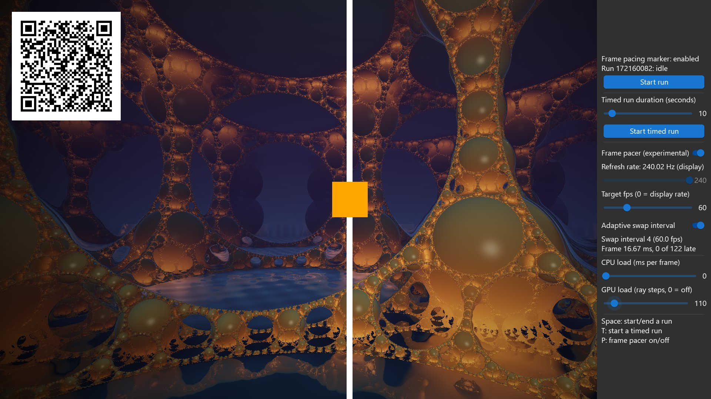
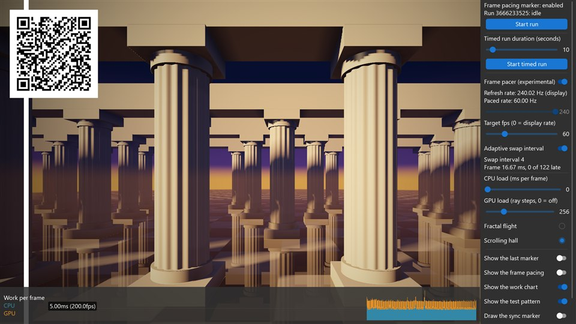

<!-- #AG_DEMOAPP_HEADER_BEGIN# -->
# FramePacing

<!-- #AG_DEMOAPP_HEADER_END# -->
<!-- #AG_BRIEF_BEGIN# -->
Shows how to control the [mb-framepacing](https://github.com/Unarmed1000/mb-framepacing) frame marker through the IFramePacingMarkerService.
<!-- #AG_BRIEF_END# -->

The host draws a QR frame marker (frame index + animation time) on top of every frame so a capture of the display output can be analysed
for animation error. Every app supports it through the `--FramePacing` command line arguments, this sample just enables it by default
and lets you control measured runs:

- **Space** or **Start run**: start an open ended run, press again to end it.
- **T** or **Start timed run**: start a run that ends by itself after the duration selected with the slider (1-120 seconds,
  `--TimedRunDuration <seconds>` sets it).

The moving bar and box are animated from the same animation time the marker reports, so any hitch is visible and measurable.

## Frame pacer (experimental)

The sample can also pace its frames with the experimental frame pacer of mb-framepacing (the framework itself has no frame pacer). The
pacer gives every frame the swap interval to hold it for and the time step to animate it by, and the sample tells the marker what the
frame was paced by, so the marker also reports the intended display time, the target frame time and the preferred frame time.

Control                       |Argument                        |Description
------------------------------|--------------------------------|----------------------------------------------------------------------------------------------------------------------------------------------------------------------------------------------------------------------------------------
Frame pacer (or the **P** key)|`--Pacer`                       |Switch the frame pacer on and off.
Refresh rate                  |`--Pacer.RefreshRate <hz>`      |The refresh rate of the display. It is read from the window system, the slider only sets it when the window system does not know it. The argument overrides both and allows decimals (59.94).
Target fps                    |`--Pacer.TargetFps <fps>`       |The frame rate the pacer aims for, 0 is the refresh rate of the display. 30 on a 60 Hz display holds every frame for two refreshes.
Adaptive swap interval        |`--Pacer.Adaptive <true\|false>`|On: the pacer slows down when frames are late and speeds up again when they fit. Off: a fixed frame rate.
CPU load                      |`--CpuLoad <ms>`                |The time in milliseconds the app spends busy every frame.
GPU load                      |`--GpuLoad <steps>`             |Draws the background with the given load (0 is no background, the default is a low load of 16). The cost grows linearly with it. It is the number of steps of every ray, more steps reach further; for the lace every doubling of it adds a round of finer detail and the rest of it is samples per pixel.
Background                    |`--Background <name>`           |The scene of the background (the radio buttons below the GPU load). `blobs` (the default) is a flight through blobs that melt into each other and `lace` is circles packed into circles: both are cheap at a low load. `flight` is a raymarched flight through a fractal lattice and `hall` a raymarched hall of columns that scrolls sideways at a constant speed, which makes a stutter easy to see: both cost a lot from the first step on.
Background resolution         |`--BackgroundScale <percent>`   |The resolution the background is drawn at, in percent of the resolution of the window (10-100, the default is 100). Below 100 it is drawn into a smaller picture that is enlarged to the window, so its cost falls with the number of pixels: for a GPU that is limited by the pixels. The UI, the marker and the test pattern stay sharp.

The target fps slider and the adaptive switch can only be changed while the frame pacer is on. The line below the refresh rate shows the
rate the frames are paced at: the refresh rate divided by the swap interval. The two status lines below the switches show the swap interval
and the frame time that was measured, with how many of the last frames were late. They are shown with the pacer off as well: every frame is
then held for one refresh, and the late frames are the ones of the last two seconds that took more than one refresh.

Two overlays at the top right can be switched on and off (`Show the last marker` and `Show the frame pacing`, or start without them with
`--HideMarkerStats` and `--HidePacingStats`). The first shows every value of the last marker. The second shows what the frame pacing does:
the swap interval (and the one of the target frame rate), the average frame time of the last two seconds with the shortest and the longest
one, the late frames, the work of the last frame (the CPU time, and the GPU time if the app measures it), the average work the pacer decides
on as a share of the frame time, how long the present was delayed, how often the pacer made the swap interval longer (slower) or shorter
(faster) and when it last did, and the time its frame window spans. The values only the pacer has show `pacer off` while it is off. The
controls at the right can be scrolled if the window is too low for them.

The chart at the bottom shows the work of every frame: the CPU time and on top of it the GPU time, which together are the work the pacer is
told the frame needed (`Show the work chart`, or start without it with `--HideWorkChart`). What the GPU time is depends on the API, see the
next section. The moving bar and box (the test pattern) can be switched off as well (`Show the test pattern`, `--HideTestPattern`). The
small sync marker of the frame pacing marker at the bottom left can be switched on (`Draw the sync marker`, or start with it with
`--FramePacing.SyncMarker`): it carries the run id and the frame index as well, the analysis detects tearing when the two markers disagree,
and camera capture needs it for its timing.

The box animation of the mb-framepacing-explained videos can be shown as well (`Show the box animation`, `Fast box animation`, or start with
it with `--BoxAnimation normal` or `--BoxAnimation fast`; it is off by default). It is a white box that eases from side to side with a
short rest at both ends, in the part of the window that is left of the controls: a round trip takes four seconds, two when fast. The box is
drawn where the animation time of the frame puts it, exactly as the test pattern is, so the motion on the display can be compared by eye
with what those videos show for a steady frame rate, a wrong animation step or a frame that is shown late. Only the box is drawn, on top of
the background and of the test pattern: for a clear view of it switch the test pattern and the two overlays off (`--HideTestPattern
--HideMarkerStats --HidePacingStats`).

## What the OpenGL ES 3 version measures

The three versions of the sample differ in what they can measure and in how they hold a frame. This one:

- **The GPU time is measured with a timer query, and the sample never waits for the GPU.** A time elapsed query of
  `GL_EXT_disjoint_timer_query` is put around all the commands of a frame, with the frame pacer on or off. Its result is read once the GPU
  has it, a few frames later, so the GPU time the pacer is told with a frame is the one of an earlier frame (the sample has four queries,
  a frame is not measured while all of them are in use). A result the driver flags as disjoint is thrown away. The sample does not call
  `glFinish`: a wait for the GPU costs throughput, only measures the work that was left when the CPU was done and changes the loop that
  is measured. **Without the extension there is no GPU time: the chart and the `Work` row of the frame pacing overlay show the CPU time
  only, and that is all the pacer is told.**
- **A frame is held with `eglSwapInterval`.** A EGL config only supports a range of swap intervals (it can be as short as one refresh). The
  sample holds the frame for the rest by delaying the swap, which is less even than a real swap interval.
- **A GPU load of 0 draws no background at all.** The screen is then only cleared, so what is left of the GPU time is the UI and the marker.

The GPU load is the background, which has four scenes. `Blobs` and `Lace` are cheap at a low load, so a slow GPU has a load that fits in a frame. `Blobs` is a flight through a field of blobs that melt into each other, sphere traced with cheap steps: more
steps reach further into the field. `Lace` is a lace of circles packed into circles drawn with gold threads, which the
animation zooms into and out of. Its load adds detail: every doubling of it is one more round of finer circles (four rounds at the default
load of 16, ten at 1024), and the rest of the load is the number of samples every pixel is drawn with, which smooths the edges. The finest
rounds are only drawn where they are large enough on the screen, so they show when the animation is zoomed in.

The other two are raymarched and cost a lot from the first step on. `Fractal flight` is a flight through a fractal lattice of golden spheres over water
that mirrors it. `Scrolling hall` is a hall of columns on a mirroring floor at dusk: the camera only travels sideways, at a constant speed,
so every column, shadow and tile crosses the screen at a constant speed and a frame that is shown too long or too short is easy to see.
Follow a column with the eyes to judge the pacing.

The sample code lives in [Shared/FramePacing](../../Shared/FramePacing). It only uses the API independent INativeBatch2D, except for
the background and the swap interval, which each of the GLES2, GLES3 and Vulkan versions does with its own API.

See [Doc/FramePacing.md](../../../Doc/FramePacing.md) for details.

<!-- #AG_DEMOAPP_COMMANDLINE_ARGUMENTS_BEGIN# -->

Command line arguments:

Argument                          |Description                                                                                                                                                                                                                                                                                                                                                                                                                                                                                        |Source
----------------------------------|---------------------------------------------------------------------------------------------------------------------------------------------------------------------------------------------------------------------------------------------------------------------------------------------------------------------------------------------------------------------------------------------------------------------------------------------------------------------------------------------------|------------------------
--Background \<arg>               |The scene of the background: blobs (a flight through blobs that melt into each other, cheap at a low load, the default), lace (circles packed into circles that the animation zooms into, cheap at a low load, more load adds finer detail), flight (a raymarched flight through a fractal lattice) or hall (a raymarched hall of columns that scrolls sideways at a constant speed, which makes a stutter easy to see).                                                                           |Demo
--BackgroundScale \<arg>          |The resolution the background is drawn at, in percent of the resolution of the window (10-100, the default is 100). Below 100 it is drawn into a smaller picture that is enlarged, for a GPU that is limited by the number of pixels.                                                                                                                                                                                                                                                              |Demo
--BoxAnimation \<arg>             |Show the box animation of the mb-framepacing-explained videos: a white box that eases from side to side, drawn for the animation time of the frame. off (the default), normal (a round trip in four seconds) or fast (in two).                                                                                                                                                                                                                                                                     |Demo
--CpuLoad \<arg>                  |Simulate a CPU load: the time in milliseconds the app spends busy every frame (0 = none, the default).                                                                                                                                                                                                                                                                                                                                                                                             |Demo
--GpuLoad \<arg>                  |A GPU load: the number of steps the background takes for every pixel; for the lace every doubling adds a round of finer detail and the rest is samples per pixel (0 = no background, the default is a low load of 16).                                                                                                                                                                                                                                                                             |Demo
--HideMarkerStats                 |Start with the overlay with the values of the last frame pacing marker hidden (the UI has a switch for it).                                                                                                                                                                                                                                                                                                                                                                                        |Demo
--HidePacingStats                 |Start with the overlay with the frame pacing stats hidden (the UI has a switch for it).                                                                                                                                                                                                                                                                                                                                                                                                            |Demo
--HideTestPattern                 |Start with the test pattern (the moving bar and box) hidden (the UI has a switch for it).                                                                                                                                                                                                                                                                                                                                                                                                          |Demo
--HideWorkChart                   |Start with the chart of the work per frame hidden (the UI has a switch for it).                                                                                                                                                                                                                                                                                                                                                                                                                    |Demo
--Pacer                           |Start with the frame pacer of the sample on (the experimental mb-framepacing pacer).                                                                                                                                                                                                                                                                                                                                                                                                               |Demo
--Pacer.Adaptive \<arg>           |true (default): the frame pacer adapts its swap interval to how the frames do. false: a fixed frame rate.                                                                                                                                                                                                                                                                                                                                                                                          |Demo
--Pacer.Drain \<arg>              |The refreshes the app waits once, half a second after it began to wait for the time of the pacer, so the presents that are queued between the app and the display are shown before the next one is added (Vulkan, 0 to 32, the default is 4, 0 is no such wait).                                                                                                                                                                                                                                   |Demo
--Pacer.Hold \<arg>               |How a frame is held for more than one refresh where the present has no swap interval (Vulkan): wait (the default, sleep on a timer and present: a guess), vsync (wait on the vsync of the window system and present in the middle of the time it leaves, needs the window system to say when the display refreshes), schedule (a target time on the present, needs VK_EXT_present_timing) or auto (schedule, else vsync, else wait). A method the system can not do falls back to vsync, else wait.|Demo
--Pacer.PresentFeedback \<arg>    |true: the frame pacer is given when the display showed the frames, where the app measures its presents (Vulkan with VK_EXT_present_timing). It paces the same with it and counts what the display did. Only for a display with a fixed refresh rate. false (default).                                                                                                                                                                                                                              |Demo
--Pacer.Profile \<arg>            |Where a frame waits for the time the pacer gives for the next frame, where the app has to do the waiting (Vulkan): early (the default, the frame is rendered right away and its present waits), late (the start of the frame waits and the frame is presented when it is done) or off (no wait, to capture the loop without it). With --Pacer.Hold vsync the wait is for the vsync of the window system, else for a time on the clock of the app.                                                  |Demo
--Pacer.RefreshRate \<arg>        |The refresh rate of the display in Hz the frame pacer uses, decimals are allowed (59.94). Defaults to the rate the window system reports, and to the UI slider if it does not know it.                                                                                                                                                                                                                                                                                                             |Demo
--Pacer.TargetFps \<arg>          |The frame rate the frame pacer aims for (0 = the refresh rate of the display, the default).                                                                                                                                                                                                                                                                                                                                                                                                        |Demo
--Pacer.VSyncPhase \<arg>         |For the vsync hold: where in the refresh before the one a frame is aimed at the present is done, in percent of the refresh (1 to 99, the default is 65: the middle of what was measured to be shown at the target).                                                                                                                                                                                                                                                                                |Demo
--TimedRunDuration \<arg>         |The duration in seconds of a timed run that is started in the UI (1 to 120, the default is 10).                                                                                                                                                                                                                                                                                                                                                                                                    |Demo
--ActualDpi \<arg>                |ActualDpi [x,y] Override the actual dpi reported by the native window                                                                                                                                                                                                                                                                                                                                                                                                                              |DemoHost
--BufferScale \<arg>              |BufferScale \<auto\|1> The scale of the window buffer on a window system that scales windows (Wayland). auto: follow the scale of the output, the window is sharp and has more pixels (default). 1: the window system enlarges the window                                                                                                                                                                                                                                                          |DemoHost
--DensityDpi \<arg>               |DensityDpi \<number> Override the density dpi reported by the native window                                                                                                                                                                                                                                                                                                                                                                                                                        |DemoHost
--DisplayId \<arg>                |DisplayId \<number>                                                                                                                                                                                                                                                                                                                                                                                                                                                                                |DemoHost
--EGLAlphaSize \<arg>             |Force EGL_ALPHA_SIZE to the given value                                                                                                                                                                                                                                                                                                                                                                                                                                                            |DemoHost
--EGLBlueSize \<arg>              |Force EGL_BLUE_SIZE to the given value                                                                                                                                                                                                                                                                                                                                                                                                                                                             |DemoHost
--EGLDepthSize \<arg>             |Force EGL_DEPTH_SIZE to the given value                                                                                                                                                                                                                                                                                                                                                                                                                                                            |DemoHost
--EGLGreenSize \<arg>             |Force EGL_GREEN_SIZE to the given value                                                                                                                                                                                                                                                                                                                                                                                                                                                            |DemoHost
--EGLLogConfig                    |Output the EGL config to the log                                                                                                                                                                                                                                                                                                                                                                                                                                                                   |DemoHost
--EGLLogConfigs \<arg>            |Output the supported configurations to the log. 0=Off, 1=All, 2=HDR. Don't confuse this with LogConfig.                                                                                                                                                                                                                                                                                                                                                                                            |DemoHost
--EGLLogExtensions                |Output the EGL extensions to the log                                                                                                                                                                                                                                                                                                                                                                                                                                                               |DemoHost
--EGLRedSize \<arg>               |Force EGL_RED_SIZE to the given value                                                                                                                                                                                                                                                                                                                                                                                                                                                              |DemoHost
--EGLSampleBuffers \<arg>         |Force EGL_SAMPLE_BUFFERS to the given value                                                                                                                                                                                                                                                                                                                                                                                                                                                        |DemoHost
--EGLSamples \<arg>               |Force EGL_SAMPLES to the given value                                                                                                                                                                                                                                                                                                                                                                                                                                                               |DemoHost
--VSyncSource \<arg>              |VSyncSource \<name> Select the vsync source of the window (default: auto)                                                                                                                                                                                                                                                                                                                                                                                                                          |DemoHost
--Window \<arg>                   |Window mode [left,top,width,height]                                                                                                                                                                                                                                                                                                                                                                                                                                                                |DemoHost
--AppFirewall                     |Enable the app firewall, reporting crashes on-screen instead of exiting                                                                                                                                                                                                                                                                                                                                                                                                                            |DemoHostManager
--ContentMonitor                  |Monitor the Content directory for changes and restart the app on changes.WARNING: Might not work on all platforms and it might impact app performance (experimental)                                                                                                                                                                                                                                                                                                                               |DemoHostManager
--ExitAfterDuration \<arg>        |Exit after the given duration has passed. The value can be specified in seconds or milliseconds. For example 10s or 10ms.                                                                                                                                                                                                                                                                                                                                                                          |DemoHostManager
--ExitAfterFrame \<arg>           |Exit after the given number of frames has been rendered                                                                                                                                                                                                                                                                                                                                                                                                                                            |DemoHostManager
--ForceUpdateTime \<arg>          |Force the update time to be the given value in microseconds (can be useful when taking a lot of screen-shots). If 0 this option is disabled                                                                                                                                                                                                                                                                                                                                                        |DemoHostManager
--LogStats                        |Log basic rendering stats (this is equal to setting LogStatsMode to latest)                                                                                                                                                                                                                                                                                                                                                                                                                        |DemoHostManager
--LogStatsMode \<arg>             |Set the log stats mode, more advanced version of LogStats. Can be disabled, latest, average                                                                                                                                                                                                                                                                                                                                                                                                        |DemoHostManager
--ScreenshotFormat \<arg>         |Chose the format for the screenshot: bmp, jpg, png (default), tga                                                                                                                                                                                                                                                                                                                                                                                                                                  |DemoHostManager
--ScreenshotFrequency \<arg>      |Create a screenshot at the given frame frequency                                                                                                                                                                                                                                                                                                                                                                                                                                                   |DemoHostManager
--ScreenshotNamePrefix \<arg>     |Chose the screenshot name prefix (defaults to 'Screenshot')                                                                                                                                                                                                                                                                                                                                                                                                                                        |DemoHostManager
--ScreenshotNameScheme \<arg>     |Chose the screenshot name scheme: frame (default), sequence, exact.                                                                                                                                                                                                                                                                                                                                                                                                                                |DemoHostManager
--Stats                           |Display basic frame profiling stats                                                                                                                                                                                                                                                                                                                                                                                                                                                                |DemoHostManager
--StatsFlags \<arg>               |Select the stats to be displayed/logged. Defaults to frame\|cpu. Can be 'frame', 'cpu', 'gpu' or any combination                                                                                                                                                                                                                                                                                                                                                                                   |DemoHostManager
--Version                         |Print version information                                                                                                                                                                                                                                                                                                                                                                                                                                                                          |DemoHostManager
--FramePacing                     |Draw the mb-framepacing frame marker (frame index + animation time as a QR code) on top of every frame.                                                                                                                                                                                                                                                                                                                                                                                            |FramePacingMarkerService
--FramePacing.CaptureHeight \<arg>|The height in pixels the capture is stored at, when set the module size is calculated so the marker survives the downscale (overrides FramePacing.ModuleSize).                                                                                                                                                                                                                                                                                                                                     |FramePacingMarkerService
--FramePacing.Duration \<arg>     |The duration in seconds of the measured part of the run started by FramePacing.Run (0 = until the app exits).                                                                                                                                                                                                                                                                                                                                                                                      |FramePacingMarkerService
--FramePacing.Log \<arg>          |Log every frame to the given CSV file: what the frame marker carries, the times of the frame loop and what the host and the app add, all as whole numbers. The events and the facts of the run are written to a '.events.csv' file next to it. It works with or without the marker being drawn.                                                                                                                                                                                                    |FramePacingMarkerService
--FramePacing.ModuleSize \<arg>   |The size of one frame pacing marker QR module in pixels. Defaults to: 6                                                                                                                                                                                                                                                                                                                                                                                                                            |FramePacingMarkerService
--FramePacing.Run \<arg>          |Start a measured run with the given name at the first frame, the name is written to the log next to the run's random sequence id. Implies --FramePacing.                                                                                                                                                                                                                                                                                                                                           |FramePacingMarkerService
--FramePacing.RunId \<arg>        |The id of the run started by FramePacing.Run (defaults to a random id).                                                                                                                                                                                                                                                                                                                                                                                                                            |FramePacingMarkerService
--FramePacing.SyncMarker          |Also draw the small frame pacing sync marker at the bottom left: it detects tearing, and camera capture needs it for its timing.                                                                                                                                                                                                                                                                                                                                                                   |FramePacingMarkerService
--Graphics.Profile                |Enable graphics service stats                                                                                                                                                                                                                                                                                                                                                                                                                                                                      |GraphicsService
--Profiler.AverageEntries \<arg>  |The number of frames used to calculate the average frame-time. Defaults to: 60                                                                                                                                                                                                                                                                                                                                                                                                                     |ProfilerService
--ghelp \<arg>                    |Display option groups: all, demo or host                                                                                                                                                                                                                                                                                                                                                                                                                                                           |base
-h, --help                        |Display options                                                                                                                                                                                                                                                                                                                                                                                                                                                                                    |base
-v, --verbose                     |Enable verbose output                                                                                                                                                                                                                                                                                                                                                                                                                                                                              |base
<!-- #AG_DEMOAPP_COMMANDLINE_ARGUMENTS_END# -->
