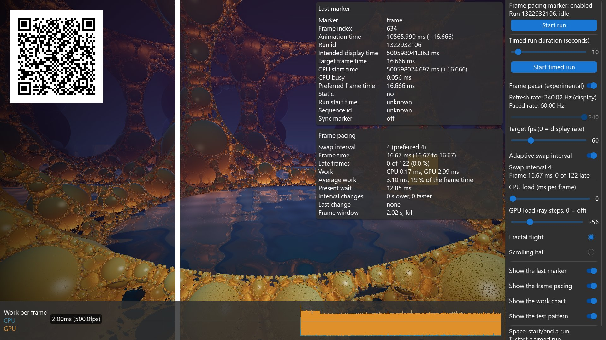

<!-- #AG_DEMOAPP_HEADER_BEGIN# -->
# FramePacing

<!-- #AG_DEMOAPP_HEADER_END# -->
<!-- #AG_BRIEF_BEGIN# -->
Shows how to control the [mb-framepacing](https://github.com/Unarmed1000/mb-framepacing) frame marker through the IFramePacingMarkerService.
<!-- #AG_BRIEF_END# -->

The host draws a QR frame marker (frame index + animation time) on top of every frame so a capture of the display output can be analysed
for animation error. Every app supports it through the `--FramePacing` command line arguments, this sample just enables it by default
and lets you control measured runs:

- **Space** or **Start run**: start an open ended run, press again to end it.
- **T** or **Start timed run**: start a run that ends by itself after the duration selected with the slider (1-120 seconds,
  `--TimedRunDuration <seconds>` sets it).

The moving bar and box are animated from the same animation time the marker reports, so any hitch is visible and measurable.

## Frame pacer (experimental)

The sample can also pace its frames with the experimental frame pacer of mb-framepacing (the framework itself has no frame pacer). The
pacer gives every frame the swap interval to hold it for and the time step to animate it by, and the sample tells the marker what the
frame was paced by, so the marker also reports the intended display time, the target frame time and the preferred frame time.

Control                       |Argument                        |Description
------------------------------|--------------------------------|---------------------------------------------------------------------------------------------------------------------------------------------------------------------------------------------
Frame pacer (or the **P** key)|`--Pacer`                       |Switch the frame pacer on and off.
Refresh rate                  |`--Pacer.RefreshRate <hz>`      |The refresh rate of the display. It is read from the window system, the slider only sets it when the window system does not know it. The argument overrides both and allows decimals (59.94).
Target fps                    |`--Pacer.TargetFps <fps>`       |The frame rate the pacer aims for, 0 is the refresh rate of the display. 30 on a 60 Hz display holds every frame for two refreshes.
Adaptive swap interval        |`--Pacer.Adaptive <true\|false>`|On: the pacer slows down when frames are late and speeds up again when they fit. Off: a fixed frame rate.
CPU load                      |`--CpuLoad <ms>`                |The time in milliseconds the app spends busy every frame.
GPU load                      |`--GpuLoad <steps>`             |Draws the raymarched background with the given number of steps for every ray (0 is no background). The load grows linearly with the steps, more steps reach further and show finer detail.

The target fps slider and the adaptive switch can only be changed while the frame pacer is on. The line below the refresh rate shows the
rate the frames are paced at: the refresh rate divided by the swap interval. The two status lines below the switches show the swap interval
and the frame time that was measured, with how many of the last frames were late. They are shown with the pacer off as well: every frame is
then held for one refresh, and the late frames are the ones of the last two seconds that took more than one refresh.

Two overlays at the top right can be switched on and off (`Show the last marker` and `Show the frame pacing`, or start without them with
`--HideMarkerStats` and `--HidePacingStats`). The first shows every value of the last marker. The second shows what the frame pacing does:
the swap interval (and the one of the target frame rate), the average frame time of the last two seconds with the shortest and the longest
one, the late frames, the work of the last frame (the CPU time, and the GPU time if the app measures it), the average work the pacer decides
on as a share of the frame time, how long the present was delayed, how often the pacer made the swap interval longer (slower) or shorter
(faster) and when it last did, and the time its frame window spans. The values only the pacer has show `pacer off` while it is off. The
controls at the right can be scrolled if the window is too low for them.

The chart at the bottom shows the work of every frame: the CPU time and on top of it the GPU time, which together are the work the pacer is
told the frame needed (`Show the work chart`, or start without it with `--HideWorkChart`). The Vulkan sample measures the GPU time with
timestamp queries. The OpenGL ES samples have no such measurement: their GPU time is the time they wait in `glFinish`, which they only do
while the pacer is on, so with the pacer off their chart only shows the CPU time. The moving bar and box (the test pattern) can be switched
off as well (`Show the test pattern`, `--HideTestPattern`).

The GLES2 and GLES3 versions hold a frame with `eglSwapInterval`. The Vulkan version can not present with a swap interval, so it delays
the present of a frame that is held for more than one refresh.

The GPU load is a raymarched background: a flight through a fractal lattice of golden spheres over water that mirrors it.

The sample code lives in [Shared/FramePacing](../../Shared/FramePacing). It only uses the API independent INativeBatch2D, except for
the background and the swap interval, which each of the GLES2, GLES3 and Vulkan versions does with its own API.

See [Doc/FramePacing.md](../../../Doc/FramePacing.md) for details.

<!-- #AG_DEMOAPP_COMMANDLINE_ARGUMENTS_BEGIN# -->

Command line arguments':

Argument                          |Description                                                                                                                                                                                                                                                                                                                |Source
----------------------------------|---------------------------------------------------------------------------------------------------------------------------------------------------------------------------------------------------------------------------------------------------------------------------------------------------------------------------|-------------------------------------------------------------------------------------------------------
--CpuLoad \<arg>                  |Simulate a CPU load: the time in milliseconds the app spends busy every frame (0 = none, the default).                                                                                                                                                                                                                     |Demo
--GpuLoad \<arg>                  |A GPU load: the number of steps the raymarched background takes for every pixel (0 = no background, the default).                                                                                                                                                                                                          |Demo
--HideMarkerStats                 |Start with the overlay with the values of the last frame pacing marker hidden (the UI has a switch for it).                                                                                                                                                                                                                |Demo
--HidePacingStats                 |Start with the overlay with the frame pacing stats hidden (the UI has a switch for it).                                                                                                                                                                                                                                    |Demo
--HideTestPattern                 |Start with the test pattern (the moving bar and box) hidden (the UI has a switch for it).                                                                                                                                                                                                                                  |Demo
--HideWorkChart                   |Start with the chart of the work per frame hidden (the UI has a switch for it).                                                                                                                                                                                                                                            |Demo
--Pacer                           |Start with the frame pacer of the sample on (the experimental mb-framepacing pacer).                                                                                                                                                                                                                                       |Demo
--Pacer.Adaptive \<arg>           |true (default): the frame pacer adapts its swap interval to how the frames do. false: a fixed frame rate.                                                                                                                                                                                                                  |Demo
--Pacer.RefreshRate \<arg>        |The refresh rate of the display in Hz the frame pacer uses, decimals are allowed (59.94). Defaults to the rate the window system reports, and to the UI slider if it does not know it.                                                                                                                                     |Demo
--Pacer.TargetFps \<arg>          |The frame rate the frame pacer aims for (0 = the refresh rate of the display, the default).                                                                                                                                                                                                                                |Demo
--TimedRunDuration \<arg>         |The duration in seconds of a timed run that is started in the UI (1 to 120, the default is 10).                                                                                                                                                                                                                            |Demo
--ActualDpi \<arg>                |ActualDpi [x,y] Override the actual dpi reported by the native window                                                                                                                                                                                                                                                      |DemoHost
--DensityDpi \<arg>               |DensityDpi \<number> Override the density dpi reported by the native window                                                                                                                                                                                                                                                |DemoHost
--DisplayId \<arg>                |DisplayId \<number>                                                                                                                                                                                                                                                                                                        |DemoHost
--LogExtensions                   |Output the extensions to the log                                                                                                                                                                                                                                                                                           |DemoHost
--LogLayers                       |Output the layers to the log                                                                                                                                                                                                                                                                                               |DemoHost
--LogSurfaceFormats               |Output the supported surface formats to the log                                                                                                                                                                                                                                                                            |DemoHost
--VkApiDump                       |Enable the VK_LAYER_LUNARG_api_dump layer.                                                                                                                                                                                                                                                                                 |DemoHost
--VkApiVersion \<arg>             |Override the Vulkan instance api version (1.0 to 1.4). It never lowers the version requested by the app. GPU assisted validation needs 1.1 or newer.                                                                                                                                                                       |DemoHost
--VkPhysicalDevice \<arg>         |Set the physical device index.                                                                                                                                                                                                                                                                                             |DemoHost
--VkPresentMode \<arg>            |Override the present mode with the supplied value. Known values: VK_PRESENT_MODE_IMMEDIATE_KHR (0), VK_PRESENT_MODE_MAILBOX_KHR (1), VK_PRESENT_MODE_FIFO_KHR (2), VK_PRESENT_MODE_FIFO_RELAXED_KHR (3), VK_PRESENT_MODE_SHARED_DEMAND_REFRESH_KHR (1000111000), VK_PRESENT_MODE_SHARED_CONTINUOUS_REFRESH_KHR (1000111001)|DemoHost
--VkScreenshot \<arg>             |Enable/disable screenshot support (defaults to enabled)                                                                                                                                                                                                                                                                    |DemoHost
--VkSwapchainMaintenance1 \<arg>  |Enable/disable the use of VK_KHR/EXT_swapchain_maintenance1 present fences (defaults to enabled if supported)                                                                                                                                                                                                              |DemoHost
--VkValidate \<arg>               |Enable/disable the VK_LAYER_LUNARG_standard_validation layer.                                                                                                                                                                                                                                                              |DemoHost
--Window \<arg>                   |Window mode [left,top,width,height]                                                                                                                                                                                                                                                                                        |DemoHost
--AppFirewall                     |Enable the app firewall, reporting crashes on-screen instead of exiting                                                                                                                                                                                                                                                    |DemoHostManager
--ContentMonitor                  |Monitor the Content directory for changes and restart the app on changes.WARNING: Might not work on all platforms and it might impact app performance (experimental)                                                                                                                                                       |DemoHostManager
--ExitAfterDuration \<arg>        |Exit after the given duration has passed. The value can be specified in seconds or milliseconds. For example 10s or 10ms.                                                                                                                                                                                                  |DemoHostManager
--ExitAfterFrame \<arg>           |Exit after the given number of frames has been rendered                                                                                                                                                                                                                                                                    |DemoHostManager
--ForceUpdateTime \<arg>          |Force the update time to be the given value in microseconds (can be useful when taking a lot of screen-shots). If 0 this option is disabled                                                                                                                                                                                |DemoHostManager
--LogStats                        |Log basic rendering stats (this is equal to setting LogStatsMode to latest)                                                                                                                                                                                                                                                |DemoHostManager
--LogStatsMode \<arg>             |Set the log stats mode, more advanced version of LogStats. Can be disabled, latest, average                                                                                                                                                                                                                                |DemoHostManager
--ScreenshotFormat \<arg>         |Chose the format for the screenshot: bmp, jpg, png (default), tga                                                                                                                                                                                                                                                          |DemoHostManager
--ScreenshotFrequency \<arg>      |Create a screenshot at the given frame frequency                                                                                                                                                                                                                                                                           |DemoHostManager
--ScreenshotNamePrefix \<arg>     |Chose the screenshot name prefix (defaults to 'Screenshot')                                                                                                                                                                                                                                                                |DemoHostManager
--ScreenshotNameScheme \<arg>     |Chose the screenshot name scheme: frame (default), sequence, exact.                                                                                                                                                                                                                                                        |DemoHostManager
--Stats                           |Display basic frame profiling stats                                                                                                                                                                                                                                                                                        |DemoHostManager
--StatsFlags \<arg>               |Select the stats to be displayed/logged. Defaults to frame\|cpu. Can be 'frame', 'cpu' or any combination                                                                                                                                                                                                                  |DemoHostManager
--Version                         |Print version information                                                                                                                                                                                                                                                                                                  |DemoHostManager
--FramePacing                     |Draw the mb-framepacing frame marker (frame index + animation time as a QR code) on top of every frame.                                                                                                                                                                                                                    |FramePacingMarkerService
--FramePacing.CaptureHeight \<arg>|The height in pixels the capture is stored at, when set the module size is calculated so the marker survives the downscale (overrides FramePacing.ModuleSize).                                                                                                                                                             |FramePacingMarkerService
--FramePacing.Duration \<arg>     |The duration in seconds of the measured part of the run started by FramePacing.Run (0 = until the app exits).                                                                                                                                                                                                              |FramePacingMarkerService
--FramePacing.ModuleSize \<arg>   |The size of one frame pacing marker QR module in pixels. Defaults to: 6                                                                                                                                                                                                                                                    |FramePacingMarkerService
--FramePacing.Run \<arg>          |Start a measured run with the given name at the first frame, the name is written to the log next to the run's random sequence id. Implies --FramePacing.                                                                                                                                                                   |FramePacingMarkerService
--FramePacing.RunId \<arg>        |The id of the run started by FramePacing.Run (defaults to a random id).                                                                                                                                                                                                                                                    |FramePacingMarkerService
--FramePacing.SyncMarker          |Also draw the small frame pacing sync marker at the bottom left: it detects tearing, and camera capture needs it for its timing.                                                                                                                                                                                           |FramePacingMarkerService
--Graphics.Profile                |Enable graphics service stats                                                                                                                                                                                                                                                                                              |GraphicsService
--Profiler.AverageEntries \<arg>  |The number of frames used to calculate the average frame-time. Defaults to: 60                                                                                                                                                                                                                                             |ProfilerService
--ghelp \<arg>                    |Display option groups: all, demo or host                                                                                                                                                                                                                                                                                   |base
-h, --help                        |Display options                                                                                                                                                                                                                                                                                                            |base
-v, --verbose                     |Enable verbose output                                                                                                                                                                                                                                                                                                      |base
<!-- #AG_DEMOAPP_COMMANDLINE_ARGUMENTS_END# -->
