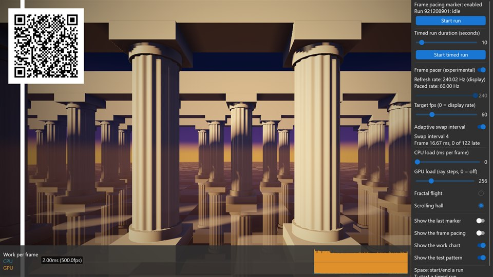

<!-- #AG_DEMOAPP_HEADER_BEGIN# -->
# FramePacing

<!-- #AG_DEMOAPP_HEADER_END# -->
<!-- #AG_BRIEF_BEGIN# -->
Shows how to control the [mb-framepacing](https://github.com/Unarmed1000/mb-framepacing) frame marker through the IFramePacingMarkerService.
<!-- #AG_BRIEF_END# -->

The host draws a QR frame marker (frame index + animation time) on top of every frame so a capture of the display output can be analysed
for animation error. Every app supports it through the `--FramePacing` command line arguments, this sample just enables it by default
and lets you control measured runs:

- **Space** or **Start run**: start an open ended run, press again to end it.
- **T** or **Start timed run**: start a run that ends by itself after the duration selected with the slider (1-120 seconds,
  `--TimedRunDuration <seconds>` sets it).
- **0**: set the switches, radio buttons and sliders of the side bar back to what the sample started with.

The side bar can be used without a mouse: the **up** and **down** arrow keys show a cursor and move it over the controls, **Enter**
uses the control the cursor is at (it toggles a switch, checks a radio button, presses a button). The **left** and **right** arrow
keys change a slider, faster the longer the key is held down, and switch a switch off and on. A click in the UI hides the cursor
again.

The moving bar and box are animated from the same animation time the marker reports, so any hitch is visible and measurable.

## Frame pacer (experimental)

The sample can also pace its frames with the experimental frame pacer of mb-framepacing (the framework itself has no frame pacer). The
pacer gives every frame the swap interval to hold it for and the time step to animate it by, and the sample tells the marker what the
frame was paced by, so the marker also reports the intended display time, the target frame time and the preferred frame time.

Control                       |Argument                        |Description
------------------------------|--------------------------------|----------------------------------------------------------------------------------------------------------------------------------------------------------------------------------------------------------------------------------------
Frame pacer (or the **P** key)|`--Pacer`                       |Switch the frame pacer on and off.
Refresh rate                  |`--Pacer.RefreshRate <hz>`      |The refresh rate of the display. It is read from the window system, the slider only sets it when the window system does not know it. The argument overrides both and allows decimals (59.94).
Target fps                    |`--Pacer.TargetFps <fps>`       |The frame rate the pacer aims for, 0 is the refresh rate of the display. 30 on a 60 Hz display holds every frame for two refreshes.
Adaptive swap interval        |`--Pacer.Adaptive <true\|false>`|On: the pacer slows down when frames are late and speeds up again when they fit. Off: a fixed frame rate.
CPU load                      |`--CpuLoad <ms>`                |The time in milliseconds the app spends busy every frame.
GPU load                      |`--GpuLoad <steps>`             |Draws the background with the given load (0 is no background, the default is a low load of 16). The cost grows linearly with it. It is the number of steps of every ray, more steps reach further; for the lace every doubling of it adds a round of finer detail and the rest of it is samples per pixel; for the Mandelbrot zoom a pixel can take eight times that many iterations, and the more of them the more of the spirals is drawn.
Background                    |`--Background <name>`           |The scene of the background (the radio buttons below the GPU load). `mandelbrot` (the default) is a zoom into a spiral of the Mandelbrot set (Seahorse Valley): the cheapest one, which a low end GPU can draw. `blobs` is a flight through blobs that melt into each other and `lace` is circles packed into circles: both are cheap at a low load. `flight` is a raymarched flight through a fractal lattice and `hall` a raymarched hall of columns that scrolls sideways at a constant speed, which makes a stutter easy to see: both cost a lot from the first step on.

The target fps slider and the adaptive switch can only be changed while the frame pacer is on. The line below the refresh rate shows the
rate the frames are paced at: the refresh rate divided by the swap interval. The two status lines below the switches show the swap interval
and the frame time that was measured, with how many of the last frames were late. They are shown with the pacer off as well: every frame is
then held for one refresh, and the late frames are the ones of the last two seconds that took more than one refresh.

Below the switch of the frame pacer the side bar has what the frames can be paced with, as one group of radio buttons: every tier
of the pacer library (see [FramePacingPlatformSupport.md](../../../Doc/FramePacingPlatformSupport.md)). The tiers are the library's and the sample has no definition of its
own. It has three major tiers by who places a frame on its refresh, each with a line of the library above its radio buttons, and
four sub tiers each, written as the two numbers with the best first: `1.1` to `3.4`.

- **Tier 1, the display places a frame and skips one that is overdue**: the present is given a time before which the frame is not
  shown, on a display side that shows the newest of the frames that are due (Vulkan with a absolute target time and the present
  mode FIFO latest ready). The library rates it and paces it as the same sub tier of tier 2.
- **Tier 2, the display places a frame**: the present is given such a time and every frame is shown (Vulkan with a absolute target
  time, `--Pacer.PresentAtTime`, which is on by default).
- **Tier 3, the frame loop places a frame**: the loop has to make the present at the right moment. Every app reaches its last sub
  tier.

A sub tier is what the frame loop paces with (`--Pacer.Kind`), each with its own color: vertical blank times with a wait for a
present (orange, `vblank-present-wait`), vertical blank times (purple, `vblank-period`), a timer with a wait for a present (blue,
`timer-present-wait`) and a timer (green, `timer-period`). In tier 3 that is their order, in tiers 1 and 2 the wait comes first
(`x.1` vertical blank times with a wait, `x.2` a timer with a wait, `x.3` vertical blank times, `x.4` a timer).

No tier is hidden: one the app does not have what it takes for is disabled. Of tiers 1 and 2 only one can be used on a system, as
what the display does with a frame that is overdue is a fact of it and not something a run chooses. The time the frame before
stays on screen at least changes no tier. That one is the switch `Timed present` (`--Pacer.TimedPresent`) below, where the present
of the app takes it: the pacer then plans that time and the sample gives it to the present, unless the present is given a time
before which the frame is not shown, as a present takes one of the two. The line below the radio buttons is the library's line for
the tier the run is in.

- The tier that is checked is the one the run is paced in, and the one it will be paced in while the frame pacer is off. The line
  below the group is the library's line for it.
- A tier that can be used here can be checked, so the tier can be switched while the sample runs. The options say which one a
  run starts with, and the default is the best one: `--Pacer.Kind vblank-present-wait` with `--Pacer.PresentAtTime true`. A tier is
  disabled when the app does not have what it takes (the library rates what the app can do): a time on the present needs a
  swapchain that takes a absolute target time, vertical blank times need a window system that tells when the display refreshes,
  and the wait for a present needs a app that can wait for one (Vulkan with `--VkPresentWait <n>`).
- What was asked for and can not be used right now gives way to the tier of what is left of it: a tier of the display placing the
  frame to the same kind where the frame loop places it, `vblank-present-wait` to `vblank-period` without a present to wait for
  and to `timer-present-wait` without vertical blank times, and each of them to `timer-period` without both. It comes back when
  it can be used again. So a run that asks for nothing is in the best tier the system has.
- With the frame pacer on the app base makes no wait for a present by itself: the pacer names the present a frame waits for, and
  `--VkPresentWait <n>` is the number of presents the pacer lets wait.

The tier the run is in and the best one the system reaches are in the `tier` event of the log and in the `FramePacing:` line of the
output. If the present of the app can hold a frame for two refreshes or more is no tier: the library rates it on its own, and it is
the `Display side holds` row of the frame pacing overlay.

Two overlays at the top right can be switched on and off (`Show the last marker` and `Show the frame pacing`, or start without them with
`--HideMarkerStats` and `--HidePacingStats`). The first shows every value of the last marker. The second shows what the frame pacing does:
on Wayland what is certain about explicit sync (`Explicit sync`: `not offered (not in use)` or `offered by the compositor`, if the
driver uses it can not be asked), the swap interval (and the one of the target frame rate), the average frame time of the last two seconds with the shortest and the longest
one, the late frames, the work of the last frame (the CPU time, and the GPU time if the app measures it), the average work the pacer decides
on as a share of the frame time, how long the present was delayed, how often the pacer made the swap interval longer (slower) or shorter
(faster) and when it last did, and the time its frame window spans. `Swap interval changes` counts from when the pacer was switched on
or one of its settings was changed last, and says for how long that is (`1 slower, 0 faster (counted for 12 s)`). The values only the
pacer has show `pacer off` while it is off. The controls at the right can be scrolled if the window is too low for them.

A time of the last marker is followed by its step from the marker before, the delta time (`DT +4.166`, in milliseconds): the
animation time, the intended display time and the CPU start time.

A value of the frame pacing overlay that asks to be looked at is yellow, and one that says the run does not do what it aims for is
red:

Value | Yellow | Red
--|--|--
`Frame time`, `Display interval` | The longest one is one and a half target frame times or more: a refresh was missed | The average is 5 % or more above the target frame time: the rate is not kept
`Late frames` | Any late frame | One frame in twenty or more is late
`Average work` | 80 % of the frame time or more | 100 % or more
`Swap interval` | Longer than the one of the target frame rate |
`Display late` | The display counted late refreshes |
`Variable refresh` | Active or seen: the display follows the frames, nothing holds a frame for a refresh |
`Swapchain refresh` | Not the refresh rate of the display the window is on |

The target frame time is the one the pacer gives, and one refresh while it is off.

The chart at the bottom shows what every frame cost, as three values that are each measured from the start of the frame: how long the
CPU worked on it, how long the GPU did, and how long the frame took, which is to the end of the last work on it. They are not parts of a
sum: the CPU and the GPU each work for a time, and a frame takes until the later of the two is done, with the time the GPU waited before it
began in it. So each is drawn as a line of its own (`Show the work chart`, or start without it with
`--HideWorkChart`). The legend of the chart says the average of each over the last 240 frames (the one of the GPU over those of them it
was measured for). The GPU time of a frame is known a frame or more after the frame ended, so the chart is that far behind, and a frame
that was not measured has no GPU time. Where a app only knows how long the GPU worked and not when it was done (the Vulkan sample
without `VK_KHR_calibrated_timestamps`, a OpenGL ES driver without timestamps), the GPU is taken to have started when the CPU's work
ended. What the GPU time is depends on the API, see the
next section. The moving bar and box (the test pattern) can be switched off as well (`Show the test pattern`, `--HideTestPattern`). The
small sync marker of the frame pacing marker at the bottom left can be switched on (`Draw the sync marker`, or start with it with
`--FramePacing.SyncMarker`): it carries the run id and the frame index as well, the analysis detects tearing when the two markers disagree,
and camera capture needs it for its timing.

The box animation of the mb-framepacing-explained videos can be shown as well (`Show the box animation`, `Fast box animation`, or start with
it with `--BoxAnimation normal` or `--BoxAnimation fast`; it is off by default). It is a white box that eases from side to side with a
short rest at both ends, in the part of the window that is left of the controls: a round trip takes four seconds, two when fast. The box is
drawn where the animation time of the frame puts it, exactly as the test pattern is, so the motion on the display can be compared by eye
with what those videos show for a steady frame rate, a wrong animation step or a frame that is shown late. Only the box is drawn, on top of
the background and of the test pattern: for a clear view of it switch the test pattern and the two overlays off (`--HideTestPattern
--HideMarkerStats --HidePacingStats`).

## What the Vulkan version measures

The three versions of the sample differ in what they can measure and in how they hold a frame. This one:

- **The GPU time is measured, with the frame pacer on or off.** The sample puts two timestamp queries around the commands of the frame and
  reads them when it records the next frame. So the chart and the `Work` row of the frame pacing overlay show the GPU time of the frame
  before, and the pacer is told the work of the GPU on a frame when it was measured. On a queue without timestamps the GPU time stays
  zero.
- **A frame is held by a time the pacer gives.** A FIFO present holds a frame for one refresh and there is no swap interval, so a
  frame that is shown for longer waits until the time the pacer gives before the host presents it. On a timer the pacer does not know
  where the refreshes are; with the vertical blank times of the window system it aims the frame at one (`--Pacer.Kind`). The
  `Present wait` row shows how long the frame waited.
- **When a frame reached the display can be measured.** With `VK_EXT_present_timing` the swapchain reports when a present was handed to
  the presentation engine and when its first pixel left for the display (`Measure the presents`). The frame pacing overlay shows how far
  that was from the time the pacer aimed for (`Display error`), how even the frames are (`Display interval`) and how long a frame took from
  its start to the display (`Latency`). The pacer has no input for these, so they are only shown. They are what the driver reports: a
  capture of the marker is the measurement.
- **The animation error is drawn.** With the display times of the frames the sample knows how far the animation of a frame was off
  where it was shown: how far the animation moved from the frame before it, less how long after that frame it was shown. That is the
  animation error, the measure of the mb-framepacing tools, and what is seen as stutter. A chart above the work chart draws it as the
  report of those tools does: a bar for each frame, up when it was shown too soon and down when it was shown too late, with a dashed
  line where a frame is a whole refresh off (`Show the animation error chart`, `--HideAnimationErrorChart`), and the `Animation error`
  row counts the frames that were more than 1 ms off. The legend of the chart counts them as stutter: how many in the last second, and
  how many in the run by their cause as those tools tell them apart, `pacing` (the display was uneven) and `jitter` (their delta time
  jitter: the display was even and the animation was not). It is made from the display times the driver reports, not from a capture.
- **When the GPU worked on a frame can be shown.** With `VK_KHR_calibrated_timestamps` the timestamp queries are converted to the clock of
  the CPU, and the `GPU work` row shows when the GPU started and finished the frame, counted from the start of the frame (`Place the GPU
  work in time`).
- **The frame loop can be logged.** `--Trace <file>` writes a trace while the sample runs: for every frame when it started, where the
  loop waited, what the pacer planned, when the frame reached the display and how busy the machine was, and what the main thread did
  in it (see [Trace.md](../../../Doc/Trace.md), [FramePacing.md](../../../Doc/FramePacing.md#the-frame-log) and
  [FramePacingCapture.md](../../../Doc/FramePacingCapture.md)).
- **A GPU load of 0 draws no background at all.** The screen is then only cleared, so what is left of the GPU time is the UI and the marker.

The two measurements are optional. Without the extension their rows show `not supported`, and each has a switch so what it adds can be
seen while the sample runs. `--VkPresentTiming false` starts without present timing.

The GPU load is the background, which has four scenes. `Blobs` and `Lace` are cheap at a low load, so a slow GPU has a load that fits in a frame. `Blobs` is a flight through a field of blobs that melt into each other, sphere traced with cheap steps: more
steps reach further into the field. `Lace` is a lace of circles packed into circles drawn with gold threads, which the
animation zooms into and out of. Its load adds detail: every doubling of it is one more round of finer circles (four rounds at the default
load of 16, ten at 1024), and the rest of the load is the number of samples every pixel is drawn with, which smooths the edges. The finest
rounds are only drawn where they are large enough on the screen, so they show when the animation is zoomed in.

The other two are raymarched and cost a lot from the first step on. `Fractal flight` is a flight through a fractal lattice of golden spheres over water
that mirrors it. `Scrolling hall` is a hall of columns on a mirroring floor at dusk: the camera only travels sideways, at a constant speed,
so every column, shadow and tile crosses the screen at a constant speed and a frame that is shown too long or too short is easy to see.
Follow a column with the eyes to judge the pacing.

The sample code lives in [Shared/FramePacing](../../Shared/FramePacing). It only uses the API independent INativeBatch2D, except for
the background and the swap interval, which each of the GLES2, GLES3 and Vulkan versions does with its own API.

See [Doc/FramePacing.md](../../../Doc/FramePacing.md) for details.

<!-- #AG_DEMOAPP_COMMANDLINE_ARGUMENTS_BEGIN# -->

Command line arguments:

Argument                          |Description                                                                                                                                                                                                                                                                                                                                                                                                                                                                                                                                                                                                                                                                                                                                                                                                                                                                                                                                                                                                              |Source
----------------------------------|-------------------------------------------------------------------------------------------------------------------------------------------------------------------------------------------------------------------------------------------------------------------------------------------------------------------------------------------------------------------------------------------------------------------------------------------------------------------------------------------------------------------------------------------------------------------------------------------------------------------------------------------------------------------------------------------------------------------------------------------------------------------------------------------------------------------------------------------------------------------------------------------------------------------------------------------------------------------------------------------------------------------------|------------------------
--Background \<arg>               |The scene of the background: mandelbrot (a zoom into a spiral of the Mandelbrot set, Seahorse Valley, the cheapest one and the default, the load is its iterations), blobs (a flight through blobs that melt into each other, cheap at a low load), lace (circles packed into circles that the animation zooms into, cheap at a low load, more load adds finer detail), flight (a raymarched flight through a fractal lattice) or hall (a raymarched hall of columns that scrolls sideways at a constant speed, which makes a stutter easy to see).                                                                                                                                                                                                                                                                                                                                                                                                                                                                      |Demo
--BoxAnimation \<arg>             |Show the box animation of the mb-framepacing-explained videos: a white box that eases from side to side, drawn for the animation time of the frame. off (the default), normal (a round trip in four seconds) or fast (in two).                                                                                                                                                                                                                                                                                                                                                                                                                                                                                                                                                                                                                                                                                                                                                                                           |Demo
--CpuLoad \<arg>                  |Simulate a CPU load: the time in milliseconds the app spends busy every frame (0 = none, the default).                                                                                                                                                                                                                                                                                                                                                                                                                                                                                                                                                                                                                                                                                                                                                                                                                                                                                                                   |Demo
--CpuSpike \<arg>                 |Simulate a frame that runs long now and then: the time in milliseconds one frame in every --CpuSpike.Interval frames is busy on top of the CPU load (0 = none, the default).                                                                                                                                                                                                                                                                                                                                                                                                                                                                                                                                                                                                                                                                                                                                                                                                                                             |Demo
--CpuSpike.Interval \<arg>        |The number of frames from one frame that runs long to the next (2 to 100000, the default is 120).                                                                                                                                                                                                                                                                                                                                                                                                                                                                                                                                                                                                                                                                                                                                                                                                                                                                                                                        |Demo
--GLFlush                         |OpenGL ES: call glFlush after the last command of a frame, so the GPU is asked to work on the frame at a known moment and before a swap the sample delays. Without it the driver decides when, the swap at the latest (the default). The trace says if it is on and when it was called.                                                                                                                                                                                                                                                                                                                                                                                                                                                                                                                                                                                                                                                                                                                                  |Demo
--GpuLoad \<arg>                  |A GPU load: the number of steps the background takes for every pixel; for the lace every doubling adds a round of finer detail and the rest is samples per pixel (0 = no background, the default is a low load of 16).                                                                                                                                                                                                                                                                                                                                                                                                                                                                                                                                                                                                                                                                                                                                                                                                   |Demo
--HideAnimationErrorChart         |Start with the chart of the animation error hidden (the UI has a switch for it). The chart is only there where the app is told when its frames were shown.                                                                                                                                                                                                                                                                                                                                                                                                                                                                                                                                                                                                                                                                                                                                                                                                                                                               |Demo
--HideMarkerStats                 |Start with the overlay with the values of the last frame pacing marker hidden (the UI has a switch for it).                                                                                                                                                                                                                                                                                                                                                                                                                                                                                                                                                                                                                                                                                                                                                                                                                                                                                                              |Demo
--HidePacingStats                 |Start with the overlay with the frame pacing stats hidden (the UI has a switch for it).                                                                                                                                                                                                                                                                                                                                                                                                                                                                                                                                                                                                                                                                                                                                                                                                                                                                                                                                  |Demo
--HideTestPattern                 |Start with the test pattern (the moving bar and box) hidden (the UI has a switch for it).                                                                                                                                                                                                                                                                                                                                                                                                                                                                                                                                                                                                                                                                                                                                                                                                                                                                                                                                |Demo
--HideWorkChart                   |Start with the chart of the work per frame hidden (the UI has a switch for it).                                                                                                                                                                                                                                                                                                                                                                                                                                                                                                                                                                                                                                                                                                                                                                                                                                                                                                                                          |Demo
--Pacer                           |Start with the frame pacer of the sample on (the experimental mb-framepacing pacer).                                                                                                                                                                                                                                                                                                                                                                                                                                                                                                                                                                                                                                                                                                                                                                                                                                                                                                                                     |Demo
--Pacer.Adaptive \<arg>           |true (default): the frame pacer adapts its swap interval to how the frames do. false: a fixed frame rate.                                                                                                                                                                                                                                                                                                                                                                                                                                                                                                                                                                                                                                                                                                                                                                                                                                                                                                                |Demo
--Pacer.Aim \<arg>                |What the pacer optimizes for: smoothness (the default: at one refresh per frame the pacer keeps frames that wait to be shown as a reserve, --Pacer.WaitingPresents less one, so a frame that runs a little long is covered and a frame reaches the screen that many refreshes later) or low-latency (the frames that wait are kept as few as the pacer can).                                                                                                                                                                                                                                                                                                                                                                                                                                                                                                                                                                                                                                                             |Demo
--Pacer.DisplayReports \<arg>     |true: the frame pacer is given when the display showed the frames, as display reports, where the app measures its presents (Vulkan with VK_EXT_present_timing). It counts the animation error of the frames from them and paces the same. Only for a display with a fixed refresh rate. false (default).                                                                                                                                                                                                                                                                                                                                                                                                                                                                                                                                                                                                                                                                                                                 |Demo
--Pacer.GpuWait                   |The kinds without a wait for a present (timer-period and vblank-period) hold the frame loop with a wait for the GPU's work on an earlier frame, where the app can make that wait (Vulkan): the pacer names the frame, the one before with the aim of low latency and the one before that with smoothness where two frames are in flight (--VkFramesInFlight 2). It is the wait for a frame slot of the app base, made for the frame the pacer names and reported to it.                                                                                                                                                                                                                                                                                                                                                                                                                                                                                                                                                  |Demo
--Pacer.Kind \<arg>               |What the pacer of the library paces the frames with: the tier that is asked for. The pacer says what to wait for before a frame starts and before it is presented, and the sample only does that. vblank-present-wait (the default and the best tier the samples reach: the pacer is told when the display of the window refreshes, so it aims a frame at a vertical blank, and before a frame it names a earlier present to wait for until it was shown: Vulkan with --VkPresentWait n, which is then the number of presents the pacer lets wait and no longer a wait of the host. From the wait it learns where in a refresh a frame has to be ready), vblank-period (the vertical blank times without the wait), timer-present-wait (the wait, on a timer and without the vertical blank times) or timer-period (a timer and the refresh period of the display, which every app has). A app that lacks what a kind uses is paced with the best kind of what it has, so the default is the best tier that is available.|Demo
--Pacer.KindChange \<arg>         |For measuring what a change of the pacer does: every that many frames the run goes on with the next of the four kinds (--Pacer.Kind says the first), in a order that has every change from one of them to another once in twelve changes. The pacer is not started again by it. 0, the default: the pacer is not changed.                                                                                                                                                                                                                                                                                                                                                                                                                                                                                                                                                                                                                                                                                                |Demo
--Pacer.PresentAtTime \<arg>      |true (default): the pacer uses the present that takes a time before which the frame is not shown, where the app has one (Vulkan with a swapchain that takes a absolute target time), so the display places the frame: the tiers of major tier 2, and of major tier 1 where the display leaves out a frame that is overdue (the present mode FIFO latest ready). false: the frame loop places the frame, the tiers of major tier 3. A app without such a present is in major tier 3 with both.                                                                                                                                                                                                                                                                                                                                                                                                                                                                                                                            |Demo
--Pacer.ReadyPlace \<arg>         |Where in a refresh the pacers vblank-period and vblank-present-wait have a frame ready (presented, and with the GPU work reported the GPU done with it), in percent of the refresh after a vertical blank (0 to 100, the default is 50, the middle). A frame that is ready there is shown at the next vertical blank: earlier leaves more room for a frame that runs long, later shows a newer frame.                                                                                                                                                                                                                                                                                                                                                                                                                                                                                                                                                                                                                    |Demo
--Pacer.RefreshRate \<arg>        |The refresh rate of the display in Hz the frame pacer uses, decimals are allowed (59.94). Defaults to the rate the window system reports, and to the UI slider if it does not know it.                                                                                                                                                                                                                                                                                                                                                                                                                                                                                                                                                                                                                                                                                                                                                                                                                                   |Demo
--Pacer.StartupPause \<arg>       |The refreshes of the pause the pacer makes once, half a second after it started, so the presents that are queued between the app and the display are shown before the next one is added (timer-period and vblank-period with the aim of low latency; 0 to 32, the default is 4, 0 is no such pause).                                                                                                                                                                                                                                                                                                                                                                                                                                                                                                                                                                                                                                                                                                                     |Demo
--Pacer.SystemHoldsLoop           |Tell the pacer timer-period that the system holds the frame loop while its queue of frames is full (a acquire or a present that waits for the display). With the aim of smoothness the pacer then lets the system pace the loop, and a frame the system held is not late. Only for a system that does hold the loop. The Vulkan sample reports its wait for the frame slot and its acquire to the pacer with or without it.                                                                                                                                                                                                                                                                                                                                                                                                                                                                                                                                                                                              |Demo
--Pacer.SystemWaits \<arg>        |true (default): the waits the app base makes by itself before a frame (the wait for a frame slot and the acquire of a Vulkan app) are reported to the pacer. On a timer the pacer then does not take a frame the system held for a late one, and on vertical blank times a start the side of the display held is not stepped over by the animation time. false: they are not reported, for a run to hold a run with them against.                                                                                                                                                                                                                                                                                                                                                                                                                                                                                                                                                                                        |Demo
--Pacer.TargetFps \<arg>          |The frame rate the frame pacer aims for (0 = the refresh rate of the display, the default).                                                                                                                                                                                                                                                                                                                                                                                                                                                                                                                                                                                                                                                                                                                                                                                                                                                                                                                              |Demo
--Pacer.TimedPresent              |The pacer uses the present that takes a time, where the app has one (Vulkan with a swapchain that takes a time the frame before stays on screen at least): the pacer plans that time and the sample gives it to the present, next to everything it does without it. It changes no tier: only a present at a time lets the display place the frame (--Pacer.PresentAtTime), and a present takes one of the two.                                                                                                                                                                                                                                                                                                                                                                                                                                                                                                                                                                                                           |Demo
--Pacer.WaitingPresents \<arg>    |The presents the pacers timer-period and timer-present-wait let wait to be shown while a frame is made, the frame itself counted (1 to 8). It is for measuring: not given or 0 the pacer picks the number, which is what a app leaves to it (it picks two).                                                                                                                                                                                                                                                                                                                                                                                                                                                                                                                                                                                                                                                                                                                                                              |Demo
--TimedRunDuration \<arg>         |The duration in seconds of a timed run that is started in the UI (1 to 120, the default is 10).                                                                                                                                                                                                                                                                                                                                                                                                                                                                                                                                                                                                                                                                                                                                                                                                                                                                                                                          |Demo
--ActualDpi \<arg>                |ActualDpi [x,y] Override the actual dpi reported by the native window                                                                                                                                                                                                                                                                                                                                                                                                                                                                                                                                                                                                                                                                                                                                                                                                                                                                                                                                                    |DemoHost
--BufferScale \<arg>              |BufferScale \<auto\|1> The scale of the window buffer on a window system that scales windows (Wayland). auto: follow the scale of the output, the window is sharp and has more pixels (default). 1: the window system enlarges the window                                                                                                                                                                                                                                                                                                                                                                                                                                                                                                                                                                                                                                                                                                                                                                                |DemoHost
--DensityDpi \<arg>               |DensityDpi \<number> Override the density dpi reported by the native window                                                                                                                                                                                                                                                                                                                                                                                                                                                                                                                                                                                                                                                                                                                                                                                                                                                                                                                                              |DemoHost
--DisplayId \<arg>                |DisplayId \<number>                                                                                                                                                                                                                                                                                                                                                                                                                                                                                                                                                                                                                                                                                                                                                                                                                                                                                                                                                                                                      |DemoHost
--LogExtensions                   |Output the extensions to the log                                                                                                                                                                                                                                                                                                                                                                                                                                                                                                                                                                                                                                                                                                                                                                                                                                                                                                                                                                                         |DemoHost
--LogLayers                       |Output the layers to the log                                                                                                                                                                                                                                                                                                                                                                                                                                                                                                                                                                                                                                                                                                                                                                                                                                                                                                                                                                                             |DemoHost
--LogSurfaceFormats               |Output the supported surface formats to the log                                                                                                                                                                                                                                                                                                                                                                                                                                                                                                                                                                                                                                                                                                                                                                                                                                                                                                                                                                          |DemoHost
--VkAcquireFenceWait \<arg>       |true: the acquire of a swapchain image gets a fence and the app base waits for it before it goes on with the frame, so the frame waits on the CPU for the image to be free. false (the default): only the GPU work of the frame waits for the image.                                                                                                                                                                                                                                                                                                                                                                                                                                                                                                                                                                                                                                                                                                                                                                     |DemoHost
--VkApiDump                       |Enable the VK_LAYER_LUNARG_api_dump layer.                                                                                                                                                                                                                                                                                                                                                                                                                                                                                                                                                                                                                                                                                                                                                                                                                                                                                                                                                                               |DemoHost
--VkApiVersion \<arg>             |Override the Vulkan instance api version (1.3 to 1.4). It never lowers the version requested by the app.                                                                                                                                                                                                                                                                                                                                                                                                                                                                                                                                                                                                                                                                                                                                                                                                                                                                                                                 |DemoHost
--VkDebugUtils \<arg>             |Enable/disable VK_EXT_debug_utils: Vulkan messages in the log, object names and command buffer labels (defaults to enabled in debug builds and when the validation layer is enabled)                                                                                                                                                                                                                                                                                                                                                                                                                                                                                                                                                                                                                                                                                                                                                                                                                                     |DemoHost
--VkFramesInFlight \<arg>         |The number of frames that may be in flight: 1 (the default) waits for the GPU to finish a frame before the next one starts, more lets the CPU start the next frames while the GPU works. Limited to what the app is configured for and to the images of the swapchain. A app that is not written for it can render wrong with more than one.                                                                                                                                                                                                                                                                                                                                                                                                                                                                                                                                                                                                                                                                             |DemoHost
--VkPhysicalDevice \<arg>         |Set the physical device index.                                                                                                                                                                                                                                                                                                                                                                                                                                                                                                                                                                                                                                                                                                                                                                                                                                                                                                                                                                                           |DemoHost
--VkPresentMode \<arg>            |Override the present mode with the supplied value. Known values: VK_PRESENT_MODE_IMMEDIATE_KHR (0), VK_PRESENT_MODE_MAILBOX_KHR (1), VK_PRESENT_MODE_FIFO_KHR (2), VK_PRESENT_MODE_FIFO_RELAXED_KHR (3), VK_PRESENT_MODE_SHARED_DEMAND_REFRESH_KHR (1000111000), VK_PRESENT_MODE_SHARED_CONTINUOUS_REFRESH_KHR (1000111001), VK_PRESENT_MODE_FIFO_LATEST_READY_KHR (1000361000)                                                                                                                                                                                                                                                                                                                                                                                                                                                                                                                                                                                                                                          |DemoHost
--VkPresentTiming \<arg>          |Enable/disable the use of VK_EXT_present_timing to measure when a frame was presented (defaults to enabled if supported for the apps that use it, true enables it for all apps)                                                                                                                                                                                                                                                                                                                                                                                                                                                                                                                                                                                                                                                                                                                                                                                                                                          |DemoHost
--VkPresentWait \<arg>            |Before a frame starts the app base waits until an earlier present was presented (VK_KHR_present_wait2, where the device and the surface have it). 0 (the default): no wait. 1: the present of the frame before. 2: the present before that one, so one present may wait for the display while the next frame is made. At most 4.                                                                                                                                                                                                                                                                                                                                                                                                                                                                                                                                                                                                                                                                                         |DemoHost
--VkScreenshot \<arg>             |Enable/disable screenshot support (defaults to enabled)                                                                                                                                                                                                                                                                                                                                                                                                                                                                                                                                                                                                                                                                                                                                                                                                                                                                                                                                                                  |DemoHost
--VkSwapchainImages \<arg>        |The number of images the swapchain is asked for at least (the default is one more than the surface needs and at least 3). The surface decides what it gives.                                                                                                                                                                                                                                                                                                                                                                                                                                                                                                                                                                                                                                                                                                                                                                                                                                                             |DemoHost
--VkSwapchainMaintenance1 \<arg>  |Enable/disable the use of VK_KHR/EXT_swapchain_maintenance1 present fences (defaults to enabled if supported)                                                                                                                                                                                                                                                                                                                                                                                                                                                                                                                                                                                                                                                                                                                                                                                                                                                                                                            |DemoHost
--VkTimelineSemaphore \<arg>      |true (default): the app base waits for the frames it submitted with one timeline semaphore. false: with a fence per frame slot.                                                                                                                                                                                                                                                                                                                                                                                                                                                                                                                                                                                                                                                                                                                                                                                                                                                                                          |DemoHost
--VkValidate \<arg>               |Enable/disable the VK_LAYER_KHRONOS_validation layer (defaults to enabled in debug builds)                                                                                                                                                                                                                                                                                                                                                                                                                                                                                                                                                                                                                                                                                                                                                                                                                                                                                                                               |DemoHost
--VkValidateFeatures \<arg>       |Enable optional checks of the validation layer, a comma separated list of: sync (synchronization), gpu (GPU assisted), bestpractices, printf (debugPrintfEXT). It enables the validation layer unless '--VkValidate false' is used.                                                                                                                                                                                                                                                                                                                                                                                                                                                                                                                                                                                                                                                                                                                                                                                      |DemoHost
--VSyncSource \<arg>              |VSyncSource \<name> Select the vsync source of the window (default: auto)                                                                                                                                                                                                                                                                                                                                                                                                                                                                                                                                                                                                                                                                                                                                                                                                                                                                                                                                                |DemoHost
--Window \<arg>                   |Window mode [left,top,width,height]                                                                                                                                                                                                                                                                                                                                                                                                                                                                                                                                                                                                                                                                                                                                                                                                                                                                                                                                                                                      |DemoHost
--AppFirewall                     |Enable the app firewall, reporting crashes on-screen instead of exiting                                                                                                                                                                                                                                                                                                                                                                                                                                                                                                                                                                                                                                                                                                                                                                                                                                                                                                                                                  |DemoHostManager
--ContentMonitor                  |Monitor the Content directory for changes and restart the app on changes.WARNING: Might not work on all platforms and it might impact app performance (experimental)                                                                                                                                                                                                                                                                                                                                                                                                                                                                                                                                                                                                                                                                                                                                                                                                                                                     |DemoHostManager
--ExitAfterDuration \<arg>        |Exit after the given duration has passed. The value can be specified in seconds or milliseconds. For example 10s or 10ms.                                                                                                                                                                                                                                                                                                                                                                                                                                                                                                                                                                                                                                                                                                                                                                                                                                                                                                |DemoHostManager
--ExitAfterFrame \<arg>           |Exit after the given number of frames has been rendered                                                                                                                                                                                                                                                                                                                                                                                                                                                                                                                                                                                                                                                                                                                                                                                                                                                                                                                                                                  |DemoHostManager
--ForceUpdateTime \<arg>          |Force the update time to be the given value in microseconds (can be useful when taking a lot of screen-shots). If 0 this option is disabled                                                                                                                                                                                                                                                                                                                                                                                                                                                                                                                                                                                                                                                                                                                                                                                                                                                                              |DemoHostManager
--LogStats                        |Log basic rendering stats (this is equal to setting LogStatsMode to latest)                                                                                                                                                                                                                                                                                                                                                                                                                                                                                                                                                                                                                                                                                                                                                                                                                                                                                                                                              |DemoHostManager
--LogStatsMode \<arg>             |Set the log stats mode, more advanced version of LogStats. Can be disabled, latest, average                                                                                                                                                                                                                                                                                                                                                                                                                                                                                                                                                                                                                                                                                                                                                                                                                                                                                                                              |DemoHostManager
--ScreenshotFormat \<arg>         |Chose the format for the screenshot: bmp, jpg, png (default), tga                                                                                                                                                                                                                                                                                                                                                                                                                                                                                                                                                                                                                                                                                                                                                                                                                                                                                                                                                        |DemoHostManager
--ScreenshotFrequency \<arg>      |Create a screenshot at the given frame frequency                                                                                                                                                                                                                                                                                                                                                                                                                                                                                                                                                                                                                                                                                                                                                                                                                                                                                                                                                                         |DemoHostManager
--ScreenshotNamePrefix \<arg>     |Chose the screenshot name prefix (defaults to 'Screenshot')                                                                                                                                                                                                                                                                                                                                                                                                                                                                                                                                                                                                                                                                                                                                                                                                                                                                                                                                                              |DemoHostManager
--ScreenshotNameScheme \<arg>     |Chose the screenshot name scheme: frame (default), sequence, exact.                                                                                                                                                                                                                                                                                                                                                                                                                                                                                                                                                                                                                                                                                                                                                                                                                                                                                                                                                      |DemoHostManager
--Stats                           |Display basic frame profiling stats                                                                                                                                                                                                                                                                                                                                                                                                                                                                                                                                                                                                                                                                                                                                                                                                                                                                                                                                                                                      |DemoHostManager
--StatsFlags \<arg>               |Select the stats to be displayed/logged. Defaults to frame\|cpu. Can be 'frame', 'cpu', 'gpu' or any combination                                                                                                                                                                                                                                                                                                                                                                                                                                                                                                                                                                                                                                                                                                                                                                                                                                                                                                         |DemoHostManager
--Version                         |Print version information                                                                                                                                                                                                                                                                                                                                                                                                                                                                                                                                                                                                                                                                                                                                                                                                                                                                                                                                                                                                |DemoHostManager
--FramePacing                     |Draw the mb-framepacing frame marker (frame index + animation time as a QR code) on top of every frame.                                                                                                                                                                                                                                                                                                                                                                                                                                                                                                                                                                                                                                                                                                                                                                                                                                                                                                                  |FramePacingMarkerService
--FramePacing.CaptureHeight \<arg>|The height in pixels the capture is stored at, when set the module size is calculated so the marker survives the downscale (overrides FramePacing.ModuleSize).                                                                                                                                                                                                                                                                                                                                                                                                                                                                                                                                                                                                                                                                                                                                                                                                                                                           |FramePacingMarkerService
--FramePacing.Duration \<arg>     |The duration in seconds of the measured part of the run started by FramePacing.Run (0 = until the app exits).                                                                                                                                                                                                                                                                                                                                                                                                                                                                                                                                                                                                                                                                                                                                                                                                                                                                                                            |FramePacingMarkerService
--FramePacing.ModuleSize \<arg>   |The size of one frame pacing marker QR module in pixels. Defaults to: 6                                                                                                                                                                                                                                                                                                                                                                                                                                                                                                                                                                                                                                                                                                                                                                                                                                                                                                                                                  |FramePacingMarkerService
--FramePacing.Run \<arg>          |Start a measured run with the given name at the first frame, the name is written to the trace next to the run's random sequence id. Implies --FramePacing.                                                                                                                                                                                                                                                                                                                                                                                                                                                                                                                                                                                                                                                                                                                                                                                                                                                               |FramePacingMarkerService
--FramePacing.RunId \<arg>        |The id of the run started by FramePacing.Run (defaults to a random id).                                                                                                                                                                                                                                                                                                                                                                                                                                                                                                                                                                                                                                                                                                                                                                                                                                                                                                                                                  |FramePacingMarkerService
--FramePacing.SyncMarker          |Also draw the small frame pacing sync marker at the bottom left: it detects tearing, and camera capture needs it for its timing.                                                                                                                                                                                                                                                                                                                                                                                                                                                                                                                                                                                                                                                                                                                                                                                                                                                                                         |FramePacingMarkerService
--Graphics.Profile                |Enable graphics service stats                                                                                                                                                                                                                                                                                                                                                                                                                                                                                                                                                                                                                                                                                                                                                                                                                                                                                                                                                                                            |GraphicsService
--Profiler.AverageEntries \<arg>  |The number of frames used to calculate the average frame-time. Defaults to: 60                                                                                                                                                                                                                                                                                                                                                                                                                                                                                                                                                                                                                                                                                                                                                                                                                                                                                                                                           |ProfilerService
--Trace \<arg>                    |Write a Perfetto trace of the app to the given file: what its main thread was doing, and every value, event and fact that is known about each frame. Open it in ui.perfetto.dev.                                                                                                                                                                                                                                                                                                                                                                                                                                                                                                                                                                                                                                                                                                                                                                                                                                         |TraceService
--Trace.Anonymise \<arg>          |on (the default) or off. While on the trace names the vendor of the graphics device in place of its model and placeholders in place of the directories of this machine.                                                                                                                                                                                                                                                                                                                                                                                                                                                                                                                                                                                                                                                                                                                                                                                                                                                  |TraceService
--ghelp \<arg>                    |Display option groups: all, demo or host                                                                                                                                                                                                                                                                                                                                                                                                                                                                                                                                                                                                                                                                                                                                                                                                                                                                                                                                                                                 |base
-h, --help                        |Display options                                                                                                                                                                                                                                                                                                                                                                                                                                                                                                                                                                                                                                                                                                                                                                                                                                                                                                                                                                                                          |base
-v, --verbose                     |Enable verbose output                                                                                                                                                                                                                                                                                                                                                                                                                                                                                                                                                                                                                                                                                                                                                                                                                                                                                                                                                                                                    |base
<!-- #AG_DEMOAPP_COMMANDLINE_ARGUMENTS_END# -->
