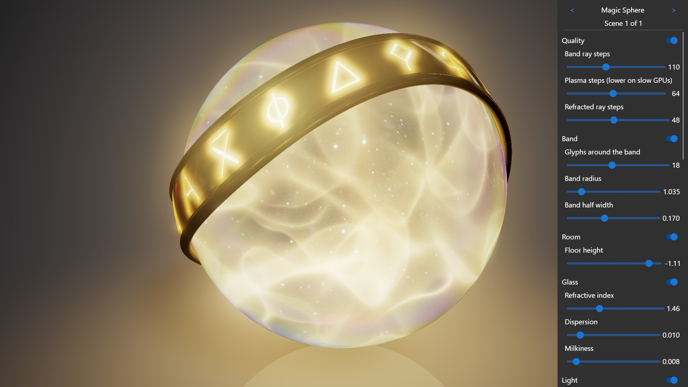

<!-- #AG_DEMOAPP_HEADER_BEGIN# -->
# PixelArt


<!-- #AG_DEMOAPP_HEADER_END# -->
<!-- #AG_BRIEF_BEGIN# -->
A player for shadertoy style scenes: the tabs, channels and uniforms of shadertoy, with every constant a scene exposes adjustable in the UI.
<!-- #AG_BRIEF_END# -->

The scenes:

Scene                 |Shadertoy                                       |Author        |License|Description
----------------------|------------------------------------------------|--------------|-------|---------------------------------------------------------
Magic Sphere          |[fXV3WK](https://www.shadertoy.com/view/fXV3WK)|Mana Battery  |BSD-3  |A solid glass orb full of golden plasma and stars, wrapped in a gold band with engraved, light-filled glyphs. It renders the scene in HDR into Buffer A and builds a two scale glow from it in Buffer B, C and D before the Image tab tonemaps it.
Raymarching Primitives|[Xds3zN](https://www.shadertoy.com/view/Xds3zN)|Inigo Quilez  |MIT    |Exact distance functions to simple primitives, ray marched with soft shadows and ambient occlusion. A single Image tab, with the anti-aliasing and the ray march steps adjustable.
Let's Self Reflect    |[XfyXRV](https://www.shadertoy.com/view/XfyXRV)|mrange        |CC0    |A Platonic solid with inner mirrors and a glass sphere inside, light bouncing between them. The shape, the sphere, the refraction and the number of bounces are adjustable.

## Controls

Control                       |Key       |Description
------------------------------|----------|-------------------------------------------------------------------------------------------------------------
`<` scene name `>`            |Left/Right|Switch scene. Switching starts the scene from the beginning, its params keep the values you gave them.
Drag in the scene             |          |iMouse, Magic Sphere and Raymarching Primitives orbit the camera.
Params of the scene           |          |Made from the `Params` of the scene's Scene.json, grouped (the switch of a group collapses it).
Reset to defaults             |R         |Set the params of the scene back to their defaults.
Render scale                  |          |The size of the buffers relative to the window (the image pass always draws the whole window).
Time speed                    |          |How fast iTime runs.
Pause                         |Space     |Stop iTime.
GPU time chart                |G         |The time the GPU needs per frame, at the bottom of the scene (Vulkan timestamp queries). `--GpuChart` starts with it shown.
Restart                       |Backspace |iTime and iFrame start from zero and the buffers are cleared.
Reload the scene              |F5        |Read the scene again (the Vulkan shaders are compiled when the app is built, so rebuild first).
Hide the UI                   |U         |The `UI` button brings it back.

## How a scene maps to shadertoy

A scene is a folder in [Shared/PixelArt/Shaders](../../Shared/PixelArt/Shaders), listed in its `Scenes.json`:

Shadertoy                                              |PixelArt
-------------------------------------------------------|-------------------------------------------------------------------------------------------------------
The tabs Common, Buffer A-D and Image                  |`Common.glsl`, `BufferA.glsl` ... `BufferD.glsl` and `Image.glsl`, with the same `mainImage`.
The iChannel0-3 of a tab, with filter, wrap and vflip  |The `Passes` of `Scene.json`, with the same names and defaults (a buffer is linear and clamped).
A buffer that reads itself (or a later buffer)         |Gets what it drew the frame before, every buffer has two images.
iResolution, iTime, iTimeDelta, iFrameRate, iFrame, iMouse, iDate, iChannelResolution, iChannelTime, iSampleRate|The same uniforms. iResolution is the size of the pass and iMouse is in its pixels.

Magic Sphere's Scene.json:

```json
"Passes": {
  "BufferA": { "iChannel0": { "Cubemap": "Textures/Cubemap/Yokohama3/Yokohama3_512.dds", "Filter": "Mipmap", "sRGB": true } },
  "BufferB": { "iChannel0": { "Buffer": "A" } },
  "BufferC": { "iChannel0": { "Buffer": "B" } },
  "BufferD": { "iChannel0": { "Buffer": "C" } },
  "Image":   { "iChannel0": { "Buffer": "A" }, "iChannel1": { "Buffer": "C" }, "iChannel2": { "Buffer": "D" } }
}
```

A channel is `{ "Buffer": "A" }`, `{ "Texture": "<content path>" }` or `{ "Cubemap": "<content path>" }`, with the optional keys
`Filter` (`Nearest`, `Linear`, `Mipmap`), `Wrap` (`Clamp`, `Repeat`), `VFlip` and `sRGB`. Keyboard, video and sound channels are not
supported.

## The adjustable constants

The `Params` of Scene.json say which constants of the shaders the UI shows:

```json
{ "Name": "IOR", "Label": "Refractive index", "Group": "Glass", "Type": "float", "Default": 1.46, "Min": 1.0, "Max": 2.4, "Step": 0.01 }
```

`Type` is `float` or `int`, `Step` and `Format` (a fmt format like `{:.3f}`) are optional. The shaders read param n with `PARAM(n)`, n is
its index in the list. The scene's `Params.glsl` turns them into the names the shader uses:

```glsl
#define IOR PARAM(7)
```

and the tab only defines the ones that are not defined, so it still runs on shadertoy as it is:

```glsl
#ifndef IOR
#define IOR 1.46
#endif
```

The app checks that Params.glsl and Scene.json agree when it loads the scene. A scene can have 64 params.

## Linear colors

The app asks for a sRGB swapchain, so a scene can work with linear colors and the GPU applies the gamma. A scene
says what its Image tab writes with `"Output": "Linear"` or `"Output": "Gamma"` (the default, a shader from shadertoy that does its own
gamma). Without a sRGB swapchain the shader converts the colors instead. Textures with `"sRGB": true` are turned into linear colors by
the GPU.

## Adding a scene

1. Make a folder in [Shared/PixelArt/Shaders](../../Shared/PixelArt/Shaders) and copy every tab of the shadertoy into `<Tab>.glsl`.
2. Write its `Scene.json`: the channels of every tab, as shadertoy shows them, and the params you want in the UI.
3. Write its `Params.glsl` and put `#ifndef` around the constants it defines.
4. Add the folder name to `Shaders/Scenes.json`.
5. For the Vulkan app: add a `.frag` for every tab to `Vulkan/PixelArt/Content.bld/PixelArt/<Scene>/` (copy one of Magic Sphere's and set the
   iChannel types to the ones in Scene.json).

No code changes are needed. Shared code for several scenes can go in `Shaders/Common` and is included with
`#include "../Common/<file>.glsl"` (relative to the file that includes it).

The `.frag` of a tab includes the prologue, the scene's Params.glsl and the tab, and the build compiles it to SPIR-V (Vulkan 1.3). The
content build also recompiles it when a file it includes changes (FslBuild 3.14.49 and newer).

The scene player lives in [Shared/PixelArt/Base](../../Shared/PixelArt/Base) (the scenes and the UI) and
[Shared/PixelArt/API/Vulkan](../../Shared/PixelArt/API/Vulkan) (the renderer). The buffers are RGBA16F images.

<!-- #AG_DEMOAPP_COMMANDLINE_ARGUMENTS_BEGIN# -->

Command line arguments':

Argument                          |Description                                                                                                                                                                                                                                                                                                                |Source
----------------------------------|---------------------------------------------------------------------------------------------------------------------------------------------------------------------------------------------------------------------------------------------------------------------------------------------------------------------------|-------------------------------------------------------------------------------------------------------
--GpuChart                        |Start with the chart of the GPU time per frame shown (G toggles it).                                                                                                                                                                                                                                                       |Demo
--HideUI                          |Start with the UI hidden (U shows it).                                                                                                                                                                                                                                                                                     |Demo
--Param \<arg>                    |Set params of the start scene: NAME=value[,NAME=value...] (the names are the defines of its Params.glsl).                                                                                                                                                                                                                  |Demo
--Paused                          |Start with the time paused.                                                                                                                                                                                                                                                                                                |Demo
--RenderScale \<arg>              |The size of the buffers relative to the window (0.25 to 1, the default is 1).                                                                                                                                                                                                                                              |Demo
--Scene \<arg>                    |The scene to start with: the name of its folder or its number in the list (1 is the first scene).                                                                                                                                                                                                                          |Demo
--Time \<arg>                     |The iTime the scene starts at in seconds (for screenshots that are the same every time).                                                                                                                                                                                                                                   |Demo
--TimeSpeed \<arg>                |How fast iTime runs (0 to 4, the default is 1).                                                                                                                                                                                                                                                                            |Demo
--ActualDpi \<arg>                |ActualDpi [x,y] Override the actual dpi reported by the native window                                                                                                                                                                                                                                                      |DemoHost
--DensityDpi \<arg>               |DensityDpi \<number> Override the density dpi reported by the native window                                                                                                                                                                                                                                                |DemoHost
--DisplayId \<arg>                |DisplayId \<number>                                                                                                                                                                                                                                                                                                        |DemoHost
--LogExtensions                   |Output the extensions to the log                                                                                                                                                                                                                                                                                           |DemoHost
--LogLayers                       |Output the layers to the log                                                                                                                                                                                                                                                                                               |DemoHost
--LogSurfaceFormats               |Output the supported surface formats to the log                                                                                                                                                                                                                                                                            |DemoHost
--VkApiDump                       |Enable the VK_LAYER_LUNARG_api_dump layer.                                                                                                                                                                                                                                                                                 |DemoHost
--VkApiVersion \<arg>             |Override the Vulkan instance api version (1.3 to 1.4). It never lowers the version requested by the app.                                                                                                                                                                                                                   |DemoHost
--VkPhysicalDevice \<arg>         |Set the physical device index.                                                                                                                                                                                                                                                                                             |DemoHost
--VkPresentMode \<arg>            |Override the present mode with the supplied value. Known values: VK_PRESENT_MODE_IMMEDIATE_KHR (0), VK_PRESENT_MODE_MAILBOX_KHR (1), VK_PRESENT_MODE_FIFO_KHR (2), VK_PRESENT_MODE_FIFO_RELAXED_KHR (3), VK_PRESENT_MODE_SHARED_DEMAND_REFRESH_KHR (1000111000), VK_PRESENT_MODE_SHARED_CONTINUOUS_REFRESH_KHR (1000111001)|DemoHost
--VkScreenshot \<arg>             |Enable/disable screenshot support (defaults to enabled)                                                                                                                                                                                                                                                                    |DemoHost
--VkSwapchainMaintenance1 \<arg>  |Enable/disable the use of VK_KHR/EXT_swapchain_maintenance1 present fences (defaults to enabled if supported)                                                                                                                                                                                                              |DemoHost
--VkValidate \<arg>               |Enable/disable the VK_LAYER_LUNARG_standard_validation layer.                                                                                                                                                                                                                                                              |DemoHost
--Window \<arg>                   |Window mode [left,top,width,height]                                                                                                                                                                                                                                                                                        |DemoHost
--AppFirewall                     |Enable the app firewall, reporting crashes on-screen instead of exiting                                                                                                                                                                                                                                                    |DemoHostManager
--ContentMonitor                  |Monitor the Content directory for changes and restart the app on changes.WARNING: Might not work on all platforms and it might impact app performance (experimental)                                                                                                                                                       |DemoHostManager
--ExitAfterDuration \<arg>        |Exit after the given duration has passed. The value can be specified in seconds or milliseconds. For example 10s or 10ms.                                                                                                                                                                                                  |DemoHostManager
--ExitAfterFrame \<arg>           |Exit after the given number of frames has been rendered                                                                                                                                                                                                                                                                    |DemoHostManager
--ForceUpdateTime \<arg>          |Force the update time to be the given value in microseconds (can be useful when taking a lot of screen-shots). If 0 this option is disabled                                                                                                                                                                                |DemoHostManager
--LogStats                        |Log basic rendering stats (this is equal to setting LogStatsMode to latest)                                                                                                                                                                                                                                                |DemoHostManager
--LogStatsMode \<arg>             |Set the log stats mode, more advanced version of LogStats. Can be disabled, latest, average                                                                                                                                                                                                                                |DemoHostManager
--ScreenshotFormat \<arg>         |Chose the format for the screenshot: bmp, jpg, png (default), tga                                                                                                                                                                                                                                                          |DemoHostManager
--ScreenshotFrequency \<arg>      |Create a screenshot at the given frame frequency                                                                                                                                                                                                                                                                           |DemoHostManager
--ScreenshotNamePrefix \<arg>     |Chose the screenshot name prefix (defaults to 'Screenshot')                                                                                                                                                                                                                                                                |DemoHostManager
--ScreenshotNameScheme \<arg>     |Chose the screenshot name scheme: frame (default), sequence, exact.                                                                                                                                                                                                                                                        |DemoHostManager
--Stats                           |Display basic frame profiling stats                                                                                                                                                                                                                                                                                        |DemoHostManager
--StatsFlags \<arg>               |Select the stats to be displayed/logged. Defaults to frame\|cpu. Can be 'frame', 'cpu' or any combination                                                                                                                                                                                                                  |DemoHostManager
--Version                         |Print version information                                                                                                                                                                                                                                                                                                  |DemoHostManager
--FramePacing                     |Draw the mb-framepacing frame marker (frame index + animation time as a QR code) on top of every frame.                                                                                                                                                                                                                    |FramePacingMarkerService
--FramePacing.CaptureHeight \<arg>|The height in pixels the capture is stored at, when set the module size is calculated so the marker survives the downscale (overrides FramePacing.ModuleSize).                                                                                                                                                             |FramePacingMarkerService
--FramePacing.Duration \<arg>     |The duration in seconds of the measured part of the run started by FramePacing.Run (0 = until the app exits).                                                                                                                                                                                                              |FramePacingMarkerService
--FramePacing.ModuleSize \<arg>   |The size of one frame pacing marker QR module in pixels. Defaults to: 6                                                                                                                                                                                                                                                    |FramePacingMarkerService
--FramePacing.Run \<arg>          |Start a measured run with the given name at the first frame, the name is written to the log next to the run's random sequence id. Implies --FramePacing.                                                                                                                                                                   |FramePacingMarkerService
--FramePacing.RunId \<arg>        |The id of the run started by FramePacing.Run (defaults to a random id).                                                                                                                                                                                                                                                    |FramePacingMarkerService
--FramePacing.SyncMarker          |Also draw the small frame pacing sync marker at the bottom left: it detects tearing, and camera capture needs it for its timing.                                                                                                                                                                                           |FramePacingMarkerService
--Graphics.Profile                |Enable graphics service stats                                                                                                                                                                                                                                                                                              |GraphicsService
--Profiler.AverageEntries \<arg>  |The number of frames used to calculate the average frame-time. Defaults to: 60                                                                                                                                                                                                                                             |ProfilerService
--ghelp \<arg>                    |Display option groups: all, demo or host                                                                                                                                                                                                                                                                                   |base
-h, --help                        |Display options                                                                                                                                                                                                                                                                                                            |base
-v, --verbose                     |Enable verbose output                                                                                                                                                                                                                                                                                                      |base
<!-- #AG_DEMOAPP_COMMANDLINE_ARGUMENTS_END# -->
