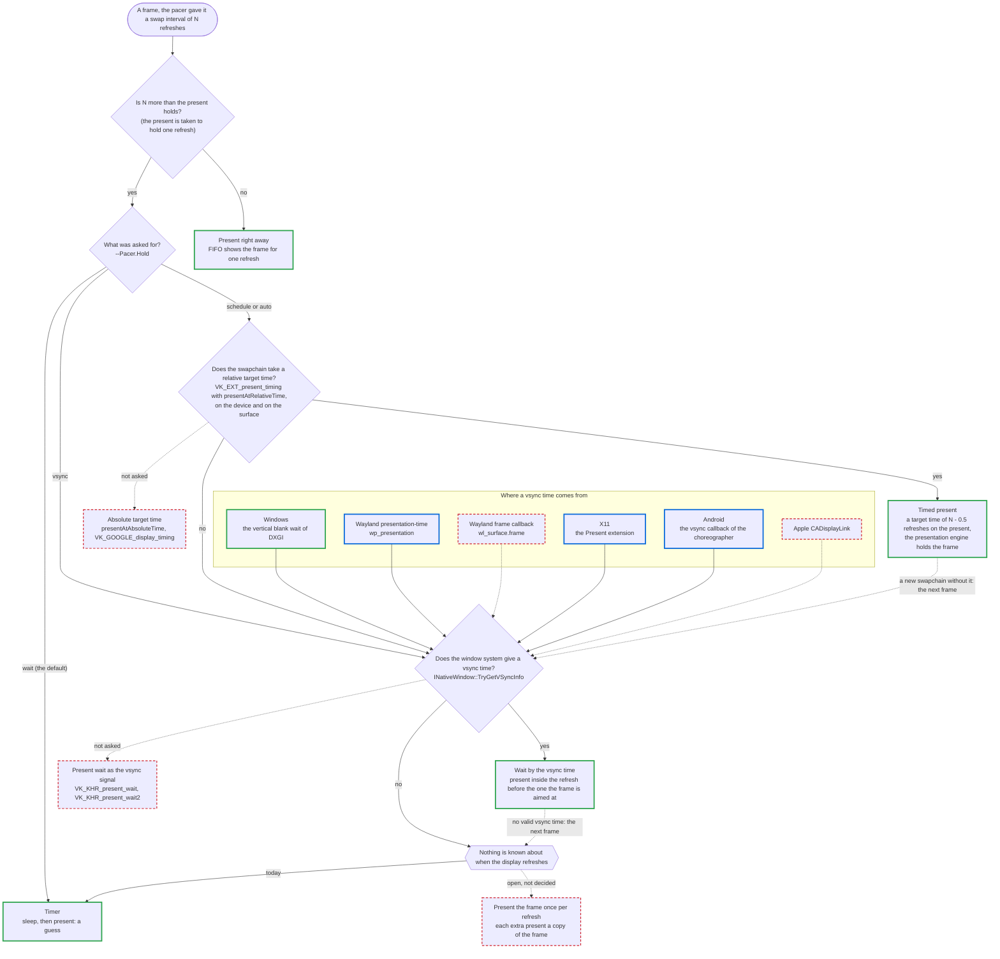

# What a platform offers for frame pacing

A frame pacer needs two things from a platform that plain rendering does not: a way to hold a frame for more than one refresh, and
some knowledge of when the display refreshes. How much of that a platform gives differs a lot, and it comes from two places: the
Vulkan device (its swapchain extensions) and the window system (the compositor).

This page lists what each can offer, from the least to the most, and what the framework does with it. See
[FramePacing.md](FramePacing.md) for the marker, the frame log and the samples, and [FramePacingCapture.md](FramePacingCapture.md) for
how the measurements were made.

**The level that must work** is the first row of both lists: core Vulkan 1.3 with a FIFO swapchain and nothing else, on a window system
that only says what its core protocol says. Everything above it is used when it is there and never required.

Status used below:

| Status | Meaning |
|---|---|
| measured | built, and checked against measured display times (Windows 11, a NVIDIA desktop GPU, 240 Hz and 120 Hz) |
| built | in the framework, not checked against a display |
| not built | the framework does nothing with it yet |

Only the Windows rows are measured. The Wayland code was run on a Ubuntu 26.04 virtual machine (GNOME, a software rasterizer, a virtual
display that does not show its frames on a fixed refresh): that shows the code works and says nothing about timing. Nothing on this
page was run on a Wayland device with a real display.

## The configurations, best first

What a device and its window system have decides how well a frame can be held for more than one refresh. This is the short version of
the lists below. At one refresh per frame every tier is the same: a FIFO present holds the frame and nothing else is needed.

| Tier | What the configuration has | How a frame is held | Who decides when it is shown | Status |
|---|---|---|---|---|
| 1 | Vulkan with `VK_EXT_present_timing` and a relative target time on the device and the surface | The present carries a target time (`--Pacer.Hold schedule`) | The presentation engine | measured (Windows, NVIDIA): every frame shown for exactly its swap interval |
| 1 | OpenGL ES | `eglSwapInterval` | The driver, it counts the refreshes | built, the display times were not measured (OpenGL ES has nothing to measure them with) |
| 2 | Vulkan FIFO on Windows | A wait on the vsync time of the monitor the window is on (`--Pacer.Hold vsync`) | The app, which knows where the refreshes are | measured at 50, 60, 120 and 240 Hz and on a 120 Hz second monitor: at least 99.6 % of the frames shown for exactly their swap interval, idle and under CPU load |
| 2 | Vulkan FIFO on a Wayland compositor with presentation-time (`wp_presentation`) | A wait on the vsync time of the compositor (`--Pacer.Hold vsync`) | The app, which knows where the refreshes are | built, run on a virtual machine only. How good it is depends on the times the compositor reports (`displayVSyncFlags`) and on where in a refresh the present has to be made, which has to be measured per compositor |
| 2 | Vulkan FIFO on a X server with the Present extension | A wait on the vsync time of the X server (`--Pacer.Hold vsync`) | The app, which knows where the refreshes are | built. Run through Xwayland on a virtual machine whose desktop was locked: the events arrive, the times were not checked |
| 2 | Vulkan FIFO on Android from API level 33 | A wait on the vsync time of the choreographer (`--Pacer.Hold vsync`) | The app, which knows where the refreshes are | built, compiled with the NDK only. Not run on a device |
| 3 | Vulkan FIFO and no vsync time: a X server without Present, a Wayland compositor without presentation-time, Android below API level 33, Apple, QNX | A timer (`--Pacer.Hold wait`) | A guess: the app does not know where the refreshes are | measured (Windows): next to no frame a refresh early or late at 50, 60 and 120 Hz. At 240 Hz from 1 % to 35 %, depending on where the timer happens to start |

`--Pacer.Hold auto` picks the best tier the system has. A log says which tier a run was in: `vulkan.uses.presentAtRelativeTime=1` is the
timed present of tier 1, a `window.vsyncSource` that is not empty is tier 2, and neither is tier 3. The `holdMethod` column says what
every frame really used.

What would move a configuration up and is not built: a present wait as the vsync signal (Vulkan level 2), the absolute target time and
`VK_GOOGLE_display_timing` (Vulkan level 3), the vsync signal of Apple, and presenting a frame once per refresh, which
needs nothing but FIFO.

## Vulkan: what the swapchain can do about time

From the least to the most.

| Level | Extensions | What it gives | What the framework does | Status |
|---|---|---|---|---|
| 0 | Core 1.3 and `VK_KHR_swapchain`, FIFO | No time goes in and none comes out. Every present is shown for one refresh. | One refresh per frame is held by the present. A frame held longer needs one of the methods [below](#holding-a-frame-for-more-than-one-refresh). | measured |
| 1 | `VK_KHR_present_id` or `VK_KHR_present_id2`; `VK_EXT_swapchain_maintenance1` or `VK_KHR_swapchain_maintenance1` | A number per present, and a fence per present that signals when the presentation engine is done with it. No display time, no timed present. | Present fences are used when available (`--VkSwapchainMaintenance1`). `VK_KHR_present_id2` numbers the presents for level 4. `VK_KHR_present_id` is not used. | measured (no effect on the pacing) |
| 2 | `VK_KHR_present_wait` or `VK_KHR_present_wait2` (with a present id) | The app can block until a given present was shown: a wait that follows the display without the window system, and a coarse display time. | Nothing. | not built |
| 3 | `VK_GOOGLE_display_timing` (Android) | The refresh duration, a desired present time per present (absolute) and past presentation times. | Nothing. | not built |
| 4 | `VK_EXT_present_timing` (with `VK_KHR_present_id2` and `VK_KHR_calibrated_timestamps`) | A target time per present, the time of each present stage afterwards (queue operations end, request dequeued, first pixel out, first pixel visible) and the refresh duration. | The stages are measured and logged. A relative target time holds a frame (`--Pacer.Hold schedule`). The display times can be given to the pacer (`--Pacer.PresentFeedback`), which counts them and paces the same. The absolute target time is not used. | measured |

Within level 4 a device and a surface can have a relative target time (`presentAtRelativeTime`), an absolute one
(`presentAtAbsoluteTime`) or both, and a surface reports only some of the stages. The NVIDIA driver that was measured has the relative
form only and reports queue operations end and first pixel out.

Not on this list: the present modes (`MAILBOX`, `IMMEDIATE`, `FIFO_RELAXED`, `FIFO_LATEST_READY` of
`VK_KHR_present_mode_fifo_latest_ready`). They change which image is shown when the app is early or late, not how long a frame is
held. `--VkPresentMode` selects one.

## Wayland: what the compositor says about time

From the least to the most. The first two are what an app can use itself. The last two are for the Vulkan window system layer of the
driver, which is what turns them into the Vulkan levels above.

| Level | Protocol | What it gives | What the framework does | Status |
|---|---|---|---|---|
| 0 | Core protocol: `wl_surface.frame`, `wl_output.mode` | A callback once per repaint, with a time in milliseconds of undefined base: a hint that can come late, bunched or not at all. The refresh rate of the mode in mHz. | The refresh rate is read. The frame callback is not used. | the refresh rate: built; the callback: not built |
| 1 | presentation-time (`wp_presentation`, `wp_presentation_feedback`), stable | For every commit: when it was presented (`presented`) and on which clock (`clock_id`), the time to the next refresh, a refresh counter and flags that say how good the time is, or `discarded` for a frame that was never shown. | The display time of a frame of the window is asked for once per frame, one request at a time, and is the vsync time of `INativeWindow::TryGetVSyncInfo` together with the refresh period the compositor reports. The flags are logged (`displayVSyncFlags`). Not used: a display time for every frame, which present feedback to the pacer would need. | built |
| 2 | fifo-v1 (`wp_fifo_manager_v1`, `wp_fifo_v1`), staging | The compositor holds a commit until the one before it was shown (`set_barrier`, `wait_barrier`): FIFO done by the compositor. | Nothing, it is for the Vulkan window system layer. | not built |
| 3 | commit-timing-v1 (`wp_commit_timing_manager_v1`, `wp_commit_timer_v1`), staging | A target time on a commit (`set_timestamp`): a timed present at the Wayland level. | Nothing, it is for the Vulkan window system layer. | not built |

Needed, but not about time: linux-dmabuf, which the Vulkan window system layer uses for its buffers.

Which protocols an older or an embedded compositor has can only be read from the device. Weston is reported to have had
presentation-time since version 1.10, which was not checked here. Nothing is known here about other compositors.

## How the two lists meet

On a Wayland device the Vulkan extensions of the first list do not come from the Vulkan version of the driver. They come from the
window system layer of the driver and from what the compositor offers that layer: a layer can only give a present a target time if
the compositor takes one, and can only report display times if the compositor reports them. A device with Vulkan 1.3 can be at level
0 of the Vulkan list, and the same driver on a newer compositor at level 4.

So both have to be looked at:

```bash
# The device extensions (Vulkan list)
vulkaninfo | grep -E "VK_KHR_present_id|VK_KHR_present_wait|swapchain_maintenance1|VK_GOOGLE_display_timing|VK_EXT_present_timing|VK_KHR_calibrated_timestamps"

# The globals of the compositor (Wayland list): wp_presentation, wp_fifo_manager_v1, wp_commit_timing_manager_v1
wayland-info      # weston-info on older images
```

A frame pacing log (`--FramePacing.Log`) says it by itself. For the Vulkan list its events file has a `vulkan.has.<extension>` fact
for each extension of the list, a `vulkan.uses.<what>` fact for what the framework enabled, and a `presentTiming` event with what the
surface supports. For the window system it has `window.system`, `window.vsyncSource` (empty when there is no vsync time), a
`window.has.<name>` fact for what the window system offers and a `window.uses.<name>` fact for what is used. On Wayland the names are the
globals of the compositor that are about time (`wp_presentation`, `wp_fifo_manager_v1`, `wp_commit_timing_manager_v1`,
`wp_tearing_control_manager_v1`, `wp_linux_drm_syncobj_manager_v1`, `zwp_linux_dmabuf_v1`), on X11 it is the `Present` extension
(its vsync source is `present`), on
Windows the calls its vsync sources are built on. The vsync sources have facts of their own: `window.vsyncSource.<name>` and
`window.vsyncSourceRequested`. The same is written to the log of the app as `FramePacing:` lines.

## Windows: the vsync sources

A window system can have more than one way to tell when the display refreshes. The window uses one of them, `--VSyncSource <name>`
selects which (`auto`, the default, takes the first that works; a name that is not a source of the window system is an error and the
app does not start), and the log lists them all with what each can do on the machine
(`window.vsyncSource.<name>` is `used`, `available` or `notAvailable`, `window.vsyncSourceRequested` is what was asked for).

Windows has one:

| Source | What it is | One per monitor | Status |
|---|---|---|---|
| `dxgi` | `IDXGIOutput::WaitForVBlank` on a thread, for the output of the monitor the window is on: the time the wait returns. | yes | measured: frames held with it are shown for exactly their swap interval, on a 240 Hz monitor and on a 120 Hz second monitor next to it |

It is the documented way to follow the vertical blank of one display, and it is the display the window is on that is followed: the
monitor is looked up from the window every time, so a window that is moved to another monitor is followed, and a change of the
display mode is picked up.

Tried and not kept, as DXGI is enough:

- The vertical blank time of the desktop compositor (`DwmGetCompositionTimingInfo`). It needs no thread and its times were within
  0.006 ms of when a frame is shown (the DXGI wait returns 0.06 ms after it at the median, up to 0.19 ms), but it is one clock for
  the whole desktop. Which monitor it follows is not something an app can rely on: it used to be the primary monitor, and on current
  Windows 11 it is the monitor with the highest refresh rate. It was a source (`dwm`) until both were captured side by side. On the
  240 Hz primary monitor the two held a frame equally well: at least 99.6 % of the frames shown for exactly their swap interval in
  every run of both, at 120, 60 and 30 fps and with work of 130 %, idle and under CPU load. On the 120 Hz second monitor the DXGI
  wait held 60 and 30 fps right, and with the compositor time the sample ran at 120 and 60 fps: a frame that is to be held for two
  refreshes was held for two refreshes of the 240 Hz monitor.
- `D3DKMTWaitForVerticalBlankEvent`, which is what the DXGI wait calls and measured the same.
- The scan line of the monitor (`D3DKMTGetScanLine` with the lines of its mode), which was 0.04 ms early and within 0.08 ms of the
  compositor time without a thread, but is a call of the kernel thunk layer that is not meant for applications.

Not built: the compositor clock of Windows 11 (`DCompositionWaitForCompositorClock` and its frame statistics), which Microsoft
documents as the replacement of the DXGI wait for apps that follow the compositor and not one display.

With two monitors at different rates the swapchain of a window on the slower one reports the refresh of the faster one
(`refreshDurationNs` of `VK_EXT_present_timing`, NVIDIA): 4.17 ms on a 120 Hz monitor next to a 240 Hz one, 8.33 ms on a 50 Hz and on
a 60 Hz monitor next to a 120 Hz one, 20.0 ms on a 24 Hz monitor next to a 50 Hz one, windowed and borderless full screen. The frames
go out on the refresh of the monitor the window is on. The window system reports the rate of that monitor, and that is the rate the
pacer is given. The overlay of the sample shows what the swapchain reports as `Swapchain refresh` and names the rate of the display
next to it when the two differ. A scheduled present goes wrong there: on a 60 Hz monitor next to a 120 Hz one it held every frame
twice as long as asked ([FramePacingCapture.md](FramePacingCapture.md)).

## Other window systems

| Platform | Vsync signal | What the framework does | Status |
|---|---|---|---|
| Windows | `IDXGIOutput::WaitForVBlank`: see the section above | `INativeWindow::TryGetVSyncInfo`, logged per frame, used by the vsync wait | measured |
| X11 | The Present extension: a refresh counter with a time stamp, for the output the window is on | The vsync source `present`: the events the X server sends for every image a graphics API presents to the window give the time of a vertical blank; a vertical blank is only asked for (`PresentNotifyMSC`) when no such events arrive (`INativeWindow::TryGetVSyncInfo`). The refresh period is measured from two of them. Needs `libxpresent-dev`. | built. Run through Xwayland on a virtual machine whose desktop was locked: the events arrive, the times were not checked |
| Android | Choreographer: a callback per refresh with the frame timelines of the next frame (for each the expected presentation time and the deadline it has to be ready by), and a callback with the vsync period | The vsync source `choreographer` (API level 33): a vsync callback is posted per frame (`AChoreographer_postVsyncCallback`), the expected presentation time of the timeline the platform prefers is the time of a vertical blank and the vsync period of the refresh rate callback is the refresh period (`INativeWindow::TryGetVSyncInfo`). The functions are looked up at run time, so an app still builds and starts for a lower API level and reports the source as not available there. The deadline of a timeline is not used. | built, compiled with the NDK only. Not run on a device |
| Apple | `CADisplayLink`: a callback per refresh with the time the next frame displays | Nothing. | not built |

`INativeWindow::TryGetVSyncInfo` returns "not known" on every platform but Windows, a Wayland compositor with presentation-time and
a X server with the Present extension. That is a valid answer, and what a platform without a usable signal keeps returning.

Each of these window systems has one documented way to follow the display, and that is the one that is built. Not built, because
they would only duplicate it or are not meant for apps: the frame callback of Wayland (`wl_surface.frame`, a hint with a millisecond
time of undefined base, for a compositor without presentation-time) and the vertical blank counter of the kernel (DRM), which a app
under a display server is not meant to open.

## Variable refresh: what a platform tells an app

With variable refresh on (G-SYNC, FreeSync, Adaptive-Sync, HDMI VRR) the display follows the frames: a vertical blank comes when a
frame arrives, and a wait on the vertical blank can not hold a frame. So an app that paces its frames wants to know. No platform has
one call for it, and "the display can do it", "it is switched on" and "the display is doing it now" are three questions:

| Platform | What answers | Can do it | Switched on | Doing it now | Status |
|---|---|---|---|---|---|
| Windows, the system | Nothing. DXGI, the display configuration and WinRT have no call for it; their "virtual refresh rate" names are the dynamic refresh rate of Windows 11. | - | - | - | - |
| Windows, the SDK of a GPU vendor | NVAPI answers all three, the SDKs of the other vendors the first two. | yes | yes | NVAPI | not used: the framework takes no vendor SDK |
| Windows, measured | The time between the vertical blanks of the display the window is on (the DXGI wait), against the refresh period of its mode. | - | - | when the frames come slower than the mode | built, measured |
| Vulkan, any platform | `VK_EXT_present_timing`: a `refreshInterval` of `UINT64_MAX` is a variable refresh mode, one equal to `refreshDuration` a fixed one, zero is not known. | - | - | per swapchain | built, and seen to say fixed for a display that was refreshing at a variable rate (NVIDIA, driver 617.14) |
| Linux (Wayland and X11) | The kernel: the properties `vrr_capable` of the connector and `VRR_ENABLED` of the CRTC. | yes | per CRTC | roughly | not built |
| Wayland | No protocol for an ordinary client. A `refresh` of zero in presentation-time is a hint. | - | hint | hint | not built |
| Android | `Display.hasArrSupport()` (Java, API level 36). | combined | combined | - | not built |
| macOS | The minimum and the maximum refresh interval of `NSScreen` differ (macOS 12). | combined | combined | - | not built |
| QNX, web | Nothing. | - | - | - | - |

`INativeWindow::TryGetVariableRefreshInfo` keeps the answers apart and names where each came from: `Supported`, `Enabled` and
`Active` are what the window system declares (nothing does yet), `Observed` is what was measured, and the Vulkan apps have what the
swapchain says separately (`DemoAppVulkanBasic::GetPresentRefreshMode`). Every one of them can be "unknown".

The measurement on Windows: the thread that waits for the vertical blanks keeps the time between the last 64 of them. The median, in
refresh periods of the mode, and the share of them that is more than 10 % off the period are reported and logged per frame
(`displayVBlankIntervalMilliPeriods`, `displayVBlankOffPeriodPerMille`). `Observed` is "yes" when the median is at least 1.1 periods
and more than half of the intervals are off the period, "no" otherwise, and "unknown" until 60 intervals were measured. Measured on
a 240 Hz mode (NVIDIA, driver 617.14, the state of the driver read with NVAPI once per second during the runs):

| The display | Frames | Median, periods | Off the period |
|---|---|---|---|
| Fixed refresh (10 runs with variable refresh off, 7 with it switched on that the driver did not use it in) | 30 to 240 per second, idle and under CPU load | 0.994 to 1.009 | none at the median, 23 % at the most for a moment |
| Variable refresh active | 120 per second | 1.98 to 2.01 | 73 to 100 % |
| Variable refresh active (an earlier run, the state as told by the person at the machine) | 60 per second | 4.0 | 100 % |
| Variable refresh active | at the rate of the mode | 1.000 (0.997 to 1.016) | none at the median |

What it can and can not tell:

- A "yes" is evidence: the display was seen to refresh off the rate of its mode. The two limits were applied to the logged numbers
  of 344 runs with variable refresh off (50, 60, 120 and 240 Hz, idle and under CPU load): they are passed in two frames, the second
  and third of one run under CPU load, where the measurement had just started and the rule gives no answer yet. In the probe with
  variable refresh switched on the rule agreed with the state of the driver in every run.
- A "no" is no proof that variable refresh is off. A display with variable refresh on refreshes like a fixed one while the frames
  come at the rate of its mode, and no measurement can tell the two apart there.
- It takes 60 vertical blanks before there is an answer, and about 40 frames at 120 frames per second before a "yes".
- The setting of the driver does not answer the question either: with G-SYNC set to "full screen only" the driver used variable
  refresh for a window in some runs and not in others, with nothing changed in between.

The FramePacing samples show the answer in the `Variable refresh` row of the overlay, and the Vulkan sample stops using the vsync
wait once variable refresh was seen (see below). The capture tool reports it per run
([FramePacingCapture.md](FramePacingCapture.md)).

## Holding a frame for more than one refresh

What the FramePacing sample does with what it finds (`--Pacer.Hold`). The OpenGL ES samples are not part of this: `eglSwapInterval`
lets the driver count the refreshes.

| Hold | Needs | How it works | Status |
|---|---|---|---|
| `schedule` | Vulkan level 4 with a relative target time | The present is given a target time and the presentation engine holds the frame. | measured on Windows with no faster monitor next to the one of the window: 336 to 337 of 337 frames held for exactly their swap interval at 50, 60 and 120 Hz, at least 98.8 % at 240 Hz. On a monitor next to one at twice its rate every frame was held twice as long |
| `vsync` | a vsync time from the window system, and a display that was not seen to refresh at a variable rate | The sample waits and presents inside the refresh before the one the frame is aimed at. | measured on Windows at 50, 60, 120 and 240 Hz: at least 99.2 % of the frames held for exactly their swap interval on an idle machine, 96.7 % in the worst run under CPU load (50 Hz). Built on Wayland (presentation-time) and X11 (Present), not measured |
| `wait` | nothing | The sample sleeps on a timer and presents. It does not know where the refreshes are, so it is a guess. | measured on Windows: close to the vsync wait at 50, 60 and 120 Hz, with a run now and then that has 3 % of its frames off. At 240 Hz from none to 35 % of the frames a refresh early or late, depending on where the timer happens to start |
| `auto` | - | `schedule` if the swapchain can, else `vsync` if the window system says when the display refreshes, else `wait`. | - |

The default is `wait`. On Windows the two ways that need no extension have been captured at 50, 60, 120 and 240 Hz
([FramePacingCapture.md](FramePacingCapture.md)), and so has the scheduled present. With variable refresh on
(G-SYNC) the vsync wait does not hold a frame and the sleep does. The sample falls back from the vsync wait to the sleep once it has
seen the display refresh at a variable rate (on Windows, see the section above), which it only can while the frames come slower
than the rate of the mode. That is a reason for `wait` to stay the default.

Where inside a refresh the vsync wait presents is not something to derive, it has to be measured per platform
(`--Pacer.VSyncPhase`, in percent of the refresh before the target). On Windows at 240 Hz a present from 55 to 75 % of the refresh was
shown at the vertical blank it was aimed at in every run, idle and under CPU load; earlier most runs had one frame shown a refresh too
long, and at 95 % the frame starts got uneven. At 120, 60 and 50 Hz every place from 5 to 85 % was clean. The late presents that
went wrong were within about a millisecond of the vertical blank at every rate, which reads as a time and not as a share of a refresh;
the early end only showed at 240 Hz, so what it is has not been settled. The default is 65 %. Those sweeps at 60 and 50 Hz had a
second monitor at 120 Hz next to the one of the window. With one monitor they were less flat (one or two frames of 337 off at most
places, 10 to 14 at 95 % at 60 Hz), and at 240 Hz with one monitor 85 % was the place that went wrong (27 and 28 of 337 off).

Not built, and still open: presenting a frame once per refresh (each extra present a copy of the frame). It needs nothing but FIFO, so
it would work at level 0 of both lists, at the cost of a copy and a present per held refresh and less time for the next frame.

Level 2 of the Vulkan list (`VK_KHR_present_wait`) could serve as the vsync signal where the window system has none. It has not been
tried.

## How the way to hold a frame is resolved

The chart shows what the Vulkan FramePacing sample does today, for every frame the pacer gave a swap interval. Nothing is decided once
at start-up: what the device and the surface can do is probed when the swapchain is created, the vsync time of the window system is
read once per frame, and the questions are asked again for every frame.

A solid green border is something that was measured, a solid blue one is built and not measured, a dashed red one is not built.
Dotted lines are things the framework does not ask or do yet. The ends were all measured on Windows, and none of them on another
platform.



The questions, in the order they are asked:

1. **Is the swap interval more than the present holds?** The sample takes a present to hold a frame for one refresh, which is what
   FIFO does. This is not probed: with a present mode that does not wait for the display (`--VkPresentMode`) the answer is wrong and
   nothing in the chart corrects it. A frame with a swap interval of one is presented right away on every path.
2. **What was asked for?** `--Pacer.Hold`, or the radio buttons. `wait` is the default until the methods have been captured at the
   refresh rates that matter, so today the timer is what runs unless something else is asked for. `auto` is the path through every
   question. A method that was asked for and that the system can not do continues at the next question, it is not an error.
3. **Does the swapchain take a relative target time?** `VK_EXT_present_timing` on the device, the `presentAtRelativeTime` feature,
   and a surface that says it supports it. The log has the answers (`vulkan.presentAtRelativeTimeDevice`, `canSchedule=` in the
   `presentTiming` event). The absolute target time of the same extension and `VK_GOOGLE_display_timing` are not asked for.
4. **Does the window system give a vsync time?** A time of a vertical blank and a refresh period, both more than zero, from
   `INativeWindow::TryGetVSyncInfo`. Windows answers, a Wayland compositor with presentation-time once a frame of the window was
   shown, a X server with the Present extension, and Android from API level 33. `VK_KHR_present_wait` could answer where the window system does not, it is not asked.

What the pacer is given is the same on every path, which is why the chart has no box for it:

| | What it is | Where it comes from |
|---|---|---|
| The refresh period | One value, given to the pacer again when it changes | The refresh rate of the display from the window system (`INativeWindow::TryGetDisplayInfo`). `--Pacer.RefreshRate` replaces it, and a slider in the sample sets it when the window system does not know it. |
| Present feedback | Off, unless `--Pacer.PresentFeedback true` and the swapchain measures display times (`VK_EXT_present_timing`) | The display time of each present (first pixel out on the driver that was measured). It does not depend on how the frame is held. |

Two periods are known and not given to the pacer: the measured refresh period of the window system, which the vsync wait uses for
its own grid of vertical blanks, and the refresh duration `VK_EXT_present_timing` reports, which is only shown. The pacer is not told
which way a frame was held either. What differs per path is where the next frame starts: at the vertical blank the frame was aimed at
after a vsync wait, and at the time the pacer gave (`NextFrameStartTime`) after a timed present and after the timer.

When a signal goes away while the sample runs:

| What goes away | What happens | Status |
|---|---|---|
| The relative target time (a new swapchain without it, after a move to another display for example) | The sample reads it every frame, so the next frame continues at question 4. | built, never seen to happen |
| The vsync time (the window system answers "not known") | The next frame is held by the timer. | built, never seen to happen |
| The vsync time is old (the compositor stopped updating it) | Not noticed. The sample goes on from the last vertical blank in whole refresh periods, for any age. On Windows a time 58 refreshes old was still within 0.006 ms of the display, so this was right every time it was measured, but nothing limits the age. On Wayland the time is that of the last frame of the window that was shown, so it gets old as soon as the window is not shown. | a known gap |
| The display changes its refresh rate | The pacer is given the new rate when the window system reports it. The vsync wait follows the period of the vsync time. | built, not measured |

The log says per frame which way was used (`holdMethod`: 0 the timer, 1 the vsync wait, 3 the timed present), so a run that changed
its way of holding a frame shows it.
