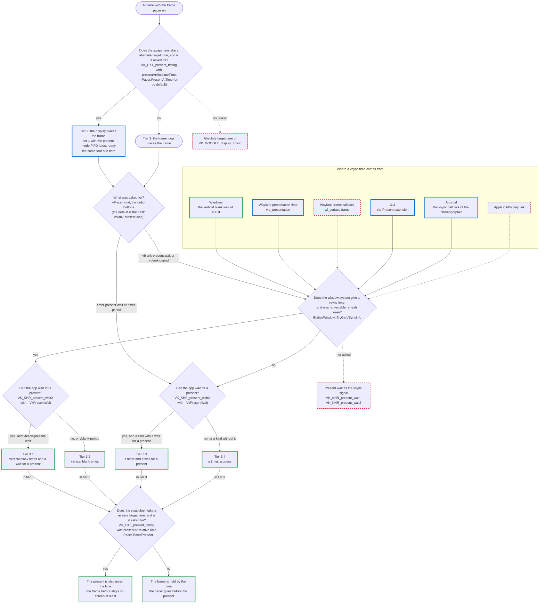

# What a platform offers for frame pacing

A frame pacer needs two things from a platform that plain rendering does not: a way to hold a frame for more than one refresh, and
some knowledge of when the display refreshes. How much of that a platform gives differs a lot, and it comes from two places: the
Vulkan device (its swapchain extensions) and the window system (the compositor).

This page lists what each can offer, from the least to the most, and what the framework does with it. See
[FramePacing.md](FramePacing.md) for the marker, the frame log and the samples, and [FramePacingCapture.md](FramePacingCapture.md) for
how the measurements were made.

**The level that must work** is the first row of both lists: core Vulkan 1.3 with a FIFO swapchain and nothing else, on a window system
that only says what its core protocol says. Everything above it is used when it is there and never required.

Status used below:

| Status | Meaning |
|---|---|
| measured | built, and checked against measured display times (Windows 11, a NVIDIA desktop GPU, 240 Hz and 120 Hz) |
| built | in the framework, not checked against a display |
| not built | the framework does nothing with it yet |

Only the Windows rows are measured. The Wayland code was run on a Ubuntu 26.04 virtual machine (GNOME, a software rasterizer, a virtual
display that does not show its frames on a fixed refresh): that shows the code works and says nothing about timing. Nothing on this
page was run on a Wayland device with a real display.

## The configurations, best first

What a device and its window system have decides how well the frames can be paced. This is the short version of the lists below. The
tiers are those of the pacer library (mb-framepacing), which rates what a app can do, and the framework has no definition of its own.
It has three major tiers with the best first, by who places a frame at its refresh, and each has the same four sub tiers. A tier is
written as the two numbers, `1.1` to `3.4`:

- **Major tier 1**: the display places the frame and skips a frame that is overdue (a present at a time, on a display that drops
  the presents whose time has passed for the newest). It is rated only: no pacer is built for it, and it is paced as the same sub
  tier of major tier 2. The Vulkan sample is in it with a swapchain that takes a absolute target time and the present mode FIFO
  latest ready.
- **Major tier 2**: the display places the frame (a present at a time). The Vulkan sample is in it with a swapchain that takes a
  absolute target time.
- **Major tier 3**: the frame loop places the frame. Every sample is in it without such a present, which is every system the
  samples were run on.

The side bar of the samples lists all twelve tiers, and the ones the app does not have what it takes for are disabled.

The four sub tiers, here with the numbers of major tier 3:

- **Tier 3.1**: vertical blank times and a wait for a present. The pacer knows where the refreshes of the display are, and before a
  frame the loop waits until the display took an earlier present.
- **Tier 3.2**: vertical blank times.
- **Tier 3.3**: a timer and a wait for a present.
- **Tier 3.4**: a timer and the refresh period only, which is a guess and what every system reaches.

A present that takes the time the frame before stays on screen at least (Vulkan with `VK_EXT_present_timing` and a relative target
time) is not a present at a time and changes no tier. With the `Timed present` switch of the samples on, the pacer plans that time,
the sample gives it to the present, and everything else is as without it.

The library has the order of the two in the middle as open until they have been measured. The wait for a present is how the presents
that wait to be shown are kept few, see
[Keeping the frame loop from getting ahead of the display](#keeping-the-frame-loop-from-getting-ahead-of-the-display). That the
display side can hold a frame for two refreshes or more (a present with a time or a minimum duration, or a swap interval of two or
more) is no tier: the library rates it on its own.

The table is about what a frame that is shown for more than one refresh is held by. At one refresh per frame every way holds a
frame the same: a FIFO present holds it and nothing else is needed for that. The pacer of the library says what a frame waits for
and the sample carries it out (`--Pacer.Kind` is what the pacer paces with). One run per case, see
[FramePacingCapture.md](FramePacingCapture.md).

| Held by | What the configuration has | How a frame is held | Who decides when it is shown | Status |
|---|---|---|---|---|
| The display side | Vulkan with `VK_EXT_present_timing` and a relative target time on the device and the surface | The present carries the time the frame before stays on screen at least (`--Pacer.TimedPresent`) | The presentation engine | measured (Windows, NVIDIA, 240 Hz, with `timer-period`): at 60 and 120 fps no frame off its swap interval on an idle machine, 141 of 1138 and 12 of 2338 under CPU load. On a monitor next to one at twice its rate every frame was held twice as long |
| The display side | OpenGL ES | `eglSwapInterval`, with the swap interval the pacer says | The driver, it counts the refreshes | built, the display times were not measured (OpenGL ES has nothing to measure them with) |
| Vertical blank times | Vulkan FIFO on Windows | The pacer is given the vsync time of the monitor the window is on and gives a time to wait until (`--Pacer.Kind vblank-period`, `vblank-present-wait`) | The pacer, which knows where the refreshes are | measured on Windows at 240 Hz with `vblank-period`: at 120, 60 and 30 fps no frame off its swap interval on an idle machine, three in each run under CPU load (of 1137, 537 and 337) |
| Vertical blank times | Vulkan FIFO on a Wayland compositor with presentation-time (`wp_presentation`) | The same with the vsync time of the compositor | The pacer, which knows where the refreshes are | built, run on a virtual machine only. How good it is depends on the times the compositor reports (`displayVSyncFlags`) and on where in a refresh a frame has to be ready, which has to be measured per compositor |
| Vertical blank times | Vulkan FIFO on a X server with the Present extension | The same with the vsync time of the X server | The pacer, which knows where the refreshes are | built. Run through Xwayland on a virtual machine whose desktop was locked: the events arrive, the times were not checked |
| Vertical blank times | Vulkan FIFO on Android from API level 33 | The same with the vsync time of the choreographer | The pacer, which knows where the refreshes are | built, compiled with the NDK only. Not run on a device |
| A timer | Vulkan FIFO and no vsync time: a X server without Present, a Wayland compositor without presentation-time, Android below API level 33, Apple, QNX | The pacer gives a time to wait until on the clock of the app (`--Pacer.Kind timer-period`, `timer-present-wait`) | A guess: the pacer does not know where the refreshes are | measured on Windows at 240 Hz with `timer-period`: at 120, 60 and 30 fps none to 8 frames of a run a refresh early or late (of 338 to 2338), idle and under CPU load |

A run without the frame pacer is in no tier: nothing holds a frame for more than one refresh.

The default of the samples is the best tier the system has: `--Pacer.Kind vblank-present-wait` is asked for, and a app that lacks
what it uses is paced with the best kind of what it has. The samples show the tiers in their side bar, below the switch of the
frame pacer, as one group of radio buttons with the best first. The one that is checked is the tier the run is paced in (the one
it will be paced in while the frame pacer is off), with the library's line for it below the group. A tier that can be used here
can be checked, and one that can not is disabled: the app does not have what the pacer uses in it.

Where the tiers of a run come from:

- **Best here** is the rating the library gives the capabilities the sample has on this system right now: vertical blank times of
  the window system that are not those of a display with a variable refresh rate, and a swapchain that can be waited on. The wait
  for a present only counts where the swapchain was made with it, which the user asks for (`--VkPresentWait`): without the option the
  best tier here is 3.2 or 3.4 also on a system that has the extension. A present with a swap interval and the longest one it takes
  (OpenGL ES) and a present with a relative target time (Vulkan with `VK_EXT_present_timing`) are what the `Display side holds` row
  of the frame pacing overlay is rated from.
- **In use** is the tier that paces the frame now, as the pacer says it: the tier of the kind (`--Pacer.Kind timer-period`,
  `timer-present-wait`, `vblank-period` and `vblank-present-wait`), and a lower one until a vertical blank was read and while the
  waits for a present are stopped (a window that is not shown). Display times the pacer is given change no tier: it counts with
  them and paces the same.

A OpenGL ES sample that has to hold a frame for longer than the swap interval of its EGL config allows holds it for the rest by
the time the pacer gives before the swap, and a EGL config that allows a swap interval of one only does not hold a frame on the
display side. The trace has a `tier` event
for the first frames and every time it changes (`tier`: the tier in use as the library writes it, `3.1` for example, and `0` with the
pacer off, and `best`: the best one this system reaches, each with its name, and `displaySideHolds`), and the app log has a `FramePacing: tier in use ...` line for
each, with the name of the vsync source of the window. A window system that gives its first vsync time after the first frame was
shown starts a run in a lower tier and changes then. The facts `vulkan.uses.presentAtRelativeTime` and
`window.vsyncSource` say what the system has, and the `pacerKind` column says what every frame was really paced with.

What would move a configuration up and is not built: a present wait as the vsync signal (Vulkan level 2),
`VK_GOOGLE_display_timing` (Vulkan level 3), the vsync signal of Apple, and presenting a frame once per refresh, which
needs nothing but FIFO.

## Vulkan: what the swapchain can do about time

From the least to the most.

| Level | Extensions | What it gives | What the framework does | Status |
|---|---|---|---|---|
| 0 | Core 1.3 and `VK_KHR_swapchain`, FIFO | No time goes in and none comes out. Every present is shown for one refresh. | One refresh per frame is held by the present. A frame held longer needs one of the methods [below](#holding-a-frame-for-more-than-one-refresh). `--VkAcquireFenceWait true` makes a frame wait for its swapchain image to be free, see [further down](#keeping-the-frame-loop-from-getting-ahead-of-the-display). | measured |
| 1 | `VK_KHR_present_id` or `VK_KHR_present_id2`; `VK_EXT_swapchain_maintenance1` or `VK_KHR_swapchain_maintenance1` | A number per present, and a fence per present that signals when the presentation engine is done with it. No display time, no timed present. | Present fences are used when available (`--VkSwapchainMaintenance1`). `VK_KHR_present_id2` numbers the presents for level 4. `VK_KHR_present_id` is not used. | measured (no effect on the pacing) |
| 2 | `VK_KHR_present_wait` or `VK_KHR_present_wait2` (with a present id) | The app can block until a given present was presented: a wait that follows the display without the window system, and a coarse display time. | With `VK_KHR_present_wait2` and `--VkPresentWait <n>` a frame of `DemoAppVulkanBasic` does not start before the present `n` frames back was presented, see [below](#keeping-the-frame-loop-from-getting-ahead-of-the-display). Off by default. `VK_KHR_present_wait` is not used, and neither is used as a vsync signal. | measured (one run per case) |
| 3 | `VK_GOOGLE_display_timing` (Android) | The refresh duration, a desired present time per present (absolute) and past presentation times. | Nothing. | not built |
| 4 | `VK_EXT_present_timing` (with `VK_KHR_present_id2` and `VK_KHR_calibrated_timestamps`) | A target time per present, the time of each present stage afterwards (queue operations end, request dequeued, first pixel out, first pixel visible) and the refresh duration. | The stages are measured and logged. A relative target time holds a frame (`--Pacer.TimedPresent`). A absolute target time lets the display place the frame (`--Pacer.PresentAtTime`, major tier 2): built and not run, no driver that was at hand has it. The display times can be given to the pacer (`--Pacer.DisplayReports`), which counts them and paces the same. | measured, but for the absolute target time |

Within level 4 a device and a surface can have a relative target time (`presentAtRelativeTime`), an absolute one
(`presentAtAbsoluteTime`) or both, and a surface reports only some of the stages. The NVIDIA driver that was measured has the relative
form only and reports queue operations end and first pixel out.

Not on this list: the present modes (`MAILBOX`, `IMMEDIATE`, `FIFO_RELAXED`, `FIFO_LATEST_READY` of
`VK_KHR_present_mode_fifo_latest_ready`). They change which image is shown when the app is early or late, not how long a frame is
held. `--VkPresentMode` selects one.

## Wayland: what the compositor says about time

From the least to the most. The first two are what an app can use itself. The last two are for the Vulkan window system layer of the
driver, which is what turns them into the Vulkan levels above.

| Level | Protocol | What it gives | What the framework does | Status |
|---|---|---|---|---|
| 0 | Core protocol: `wl_surface.frame`, `wl_output.mode` | A callback once per repaint, with a time in milliseconds of undefined base: a hint that can come late, bunched or not at all. The refresh rate of the mode in mHz. | The refresh rate is read. The frame callback is not used. | the refresh rate: built; the callback: not built |
| 1 | presentation-time (`wp_presentation`, `wp_presentation_feedback`), stable | For every commit: when it was presented (`presented`) and on which clock (`clock_id`), the time to the next refresh, a refresh counter and flags that say how good the time is, or `discarded` for a frame that was never shown. | The display time of a frame of the window is asked for once per frame, one request at a time, and is the vsync time of `INativeWindow::TryGetVSyncInfo` together with the refresh period the compositor reports. The flags are logged (`displayVSyncFlags`). Not used: a display time for every frame, which display reports to the pacer would need. | built |
| 2 | fifo-v1 (`wp_fifo_manager_v1`, `wp_fifo_v1`), staging | The compositor holds a commit until the one before it was shown (`set_barrier`, `wait_barrier`): FIFO done by the compositor. | Nothing, it is for the Vulkan window system layer. | not built |
| 3 | commit-timing-v1 (`wp_commit_timing_manager_v1`, `wp_commit_timer_v1`), staging | A target time on a commit (`set_timestamp`): a timed present at the Wayland level. | Nothing, it is for the Vulkan window system layer. | not built |

Needed, but not about time: linux-dmabuf, which the Vulkan window system layer uses for its buffers.

Which protocols an older or an embedded compositor has can only be read from the device. Weston is reported to have had
presentation-time since version 1.10, which was not checked here. Nothing is known here about other compositors.

## Explicit sync on Wayland

Not a way to hold a frame, and not something a app does. It is listed here because it is asked about.

With implicit sync the kernel and the driver work out from the buffers a command uses what it has to wait for. With explicit sync
(linux-drm-syncobj-v1: `wp_linux_drm_syncobj_manager_v1`, a timeline per client and a sync object per `wl_surface`) the client says
when a buffer is ready (a acquire point) and the compositor says when it is done with it (a release point). The client here is the
graphics API of the driver: its Vulkan window system layer or its EGL platform binds the global on the display of the app and sets the
two points on every commit it makes. The protocol says so itself: a client that uses EGL or Vulkan for a surface should not use the
protocol on that surface.

What a app can know, and what it can not:

- If the compositor offers it. That is certain: it is the global, which the trace has as the fact
  `window.has.wp_linux_drm_syncobj_manager_v1` and the frame pacing overlay of the samples as the `Explicit sync` row.
- When it is not offered (0, `not offered (not in use)`) it is not in use.
- When it is offered (1, `offered by the compositor`) the driver decides. There is no extension, no property and no query that says
  if it does, and a app must not find out by trying: a second sync object on a surface is a protocol error that ends the connection.
  So the samples do not say that it is in use.

What a app must not do once a driver may use it, and what the framework does:

- Commit on the window surface between the two points and the buffer of the driver, for example from another thread while a present
  is made. That ends the connection (`no_buffer`). The window adapter commits on the window surface once, before the first configure
  and before a swapchain or a EGL surface exists, and never again. The cursor has a surface of its own.
- Attach buffers of its own to the window surface, or take a `wp_fifo_v1` or a `wp_commit_timer_v1` for it: those are one per surface
  too and belong to the driver.
- Destroy the `wl_surface` before the swapchain, the Vulkan surface or the EGL surface. The framework destroys them first.
- Create a second Vulkan surface for the same `wl_surface`. The framework creates one per window.

What it changes for frame pacing: not when a frame is shown. A compositor waits for a buffer to be ready before it uses it with
both kinds of sync. The client gets its buffers back without waiting for the compositor to tell it. No measurement of a effect on
frame times is known here, and none was made: the compositor of the machine the Wayland side was run on does not offer it.

To compare with and without it, it is switched off outside the app: drivers and compositors have environment variables for that
(see their documentation).

## How the two lists meet

On a Wayland device the Vulkan extensions of the first list do not come from the Vulkan version of the driver. They come from the
window system layer of the driver and from what the compositor offers that layer: a layer can only give a present a target time if
the compositor takes one, and can only report display times if the compositor reports them. A device with Vulkan 1.3 can be at level
0 of the Vulkan list, and the same driver on a newer compositor at level 4.

So both have to be looked at:

```bash
# The device extensions (Vulkan list)
vulkaninfo | grep -E "VK_KHR_present_id|VK_KHR_present_wait|swapchain_maintenance1|VK_GOOGLE_display_timing|VK_EXT_present_timing|VK_KHR_calibrated_timestamps"

# The globals of the compositor (Wayland list): wp_presentation, wp_fifo_manager_v1, wp_commit_timing_manager_v1
wayland-info      # weston-info on older images
```

A trace (`--Trace`) says it by itself. For the Vulkan list it has a `vulkan.has.<extension>` fact
for each extension of the list, a `vulkan.uses.<what>` fact for what the framework enabled, and a `presentTiming` event with what the
surface supports. For the window system it has `window.system`, `window.vsyncSource` (empty when there is no vsync time), a
`window.has.<name>` fact for what the window system offers and a `window.uses.<name>` fact for what is used. On Wayland the names are the
globals of the compositor that are about time (`wp_presentation`, `wp_fifo_manager_v1`, `wp_commit_timing_manager_v1`,
`wp_tearing_control_manager_v1`, `wp_linux_drm_syncobj_manager_v1`, `zwp_linux_dmabuf_v1`), on X11 it is the `Present` extension
(its vsync source is `present`), on
Windows the calls its vsync sources are built on. The vsync sources have facts of their own: `window.vsyncSource.<name>` and
`window.vsyncSourceRequested`. The same is written to the log of the app as `FramePacing:` lines.

## Windows: the vsync sources

A window system can have more than one way to tell when the display refreshes. The window uses one of them, `--VSyncSource <name>`
selects which (`auto`, the default, takes the first that works; a name that is not a source of the window system is an error and the
app does not start), and the log lists them all with what each can do on the machine
(`window.vsyncSource.<name>` is `used`, `available` or `notAvailable`, `window.vsyncSourceRequested` is what was asked for).

Windows has one:

| Source | What it is | One per monitor | Status |
|---|---|---|---|
| `dxgi` | `IDXGIOutput::WaitForVBlank` on a thread, for the output of the monitor the window is on: the time the wait returns. | yes | measured: frames held with it are shown for exactly their swap interval, on a 240 Hz monitor and on a 120 Hz second monitor next to it |

It is the documented way to follow the vertical blank of one display, and it is the display the window is on that is followed: the
monitor is looked up from the window every time, so a window that is moved to another monitor is followed, and a change of the
display mode is picked up.

Tried and not kept, as DXGI is enough:

- The vertical blank time of the desktop compositor (`DwmGetCompositionTimingInfo`). It needs no thread and its times were within
  0.006 ms of when a frame is shown (the DXGI wait returns 0.06 ms after it at the median, up to 0.19 ms), but it is one clock for
  the whole desktop. Which monitor it follows is not something an app can rely on: it used to be the primary monitor, and on current
  Windows 11 it is the monitor with the highest refresh rate. It was a source (`dwm`) until both were captured side by side. On the
  240 Hz primary monitor the two held a frame equally well: at least 99.6 % of the frames shown for exactly their swap interval in
  every run of both, at 120, 60 and 30 fps and with work of 130 %, idle and under CPU load. On the 120 Hz second monitor the DXGI
  wait held 60 and 30 fps right, and with the compositor time the sample ran at 120 and 60 fps: a frame that is to be held for two
  refreshes was held for two refreshes of the 240 Hz monitor.
- `D3DKMTWaitForVerticalBlankEvent`, which is what the DXGI wait calls and measured the same.
- The scan line of the monitor (`D3DKMTGetScanLine` with the lines of its mode), which was 0.04 ms early and within 0.08 ms of the
  compositor time without a thread, but is a call of the kernel thunk layer that is not meant for applications.

Not built: the compositor clock of Windows 11 (`DCompositionWaitForCompositorClock` and its frame statistics), which Microsoft
documents as the replacement of the DXGI wait for apps that follow the compositor and not one display.

With two monitors at different rates the swapchain of a window on the slower one reports the refresh of the faster one
(`refreshDurationNs` of `VK_EXT_present_timing`, NVIDIA): 4.17 ms on a 120 Hz monitor next to a 240 Hz one, 8.33 ms on a 50 Hz and on
a 60 Hz monitor next to a 120 Hz one, 20.0 ms on a 24 Hz monitor next to a 50 Hz one, windowed and borderless full screen. The frames
go out on the refresh of the monitor the window is on. The window system reports the rate of that monitor, and that is the rate the
pacer is given. The overlay of the sample shows what the swapchain reports as `Swapchain refresh` and names the rate of the display
next to it when the two differ. A present that is given a time goes wrong there: on a 60 Hz monitor next to a 120 Hz one every frame
was held twice as long as asked ([FramePacingCapture.md](FramePacingCapture.md)).

## Other window systems

| Platform | Vsync signal | What the framework does | Status |
|---|---|---|---|
| Windows | `IDXGIOutput::WaitForVBlank`: see the section above | `INativeWindow::TryGetVSyncInfo`, written to the trace per frame, given to the pacer as the vertical blank times | measured |
| X11 | The Present extension: a refresh counter with a time stamp, for the output the window is on | The vsync source `present`: the events the X server sends for every image a graphics API presents to the window give the time of a vertical blank; a vertical blank is only asked for (`PresentNotifyMSC`) when no such events arrive (`INativeWindow::TryGetVSyncInfo`). The refresh period is measured from two of them. Needs `libxpresent-dev`. | built. Run through Xwayland on a virtual machine whose desktop was locked: the events arrive, the times were not checked |
| Android | Choreographer: a callback per refresh with the frame timelines of the next frame (for each the expected presentation time and the deadline it has to be ready by), and a callback with the vsync period | The vsync source `choreographer` (API level 33): a vsync callback is posted per frame (`AChoreographer_postVsyncCallback`), the expected presentation time of the timeline the platform prefers is the time of a vertical blank and the vsync period of the refresh rate callback is the refresh period (`INativeWindow::TryGetVSyncInfo`). The functions are looked up at run time, so an app still builds and starts for a lower API level and reports the source as not available there. The deadline of a timeline is not used. | built, compiled with the NDK only. Not run on a device |
| Apple | `CADisplayLink`: a callback per refresh with the time the next frame displays | Nothing. | not built |

`INativeWindow::TryGetVSyncInfo` returns "not known" on every platform but Windows, a Wayland compositor with presentation-time and
a X server with the Present extension. That is a valid answer, and what a platform without a usable signal keeps returning.

Each of these window systems has one documented way to follow the display, and that is the one that is built. Not built, because
they would only duplicate it or are not meant for apps: the frame callback of Wayland (`wl_surface.frame`, a hint with a millisecond
time of undefined base, for a compositor without presentation-time) and the vertical blank counter of the kernel (DRM), which a app
under a display server is not meant to open.

## Variable refresh: what a platform tells an app

With variable refresh on (G-SYNC, FreeSync, Adaptive-Sync, HDMI VRR) the display follows the frames: a vertical blank comes when a
frame arrives, and a wait on the vertical blank can not hold a frame. So an app that paces its frames wants to know. No platform has
one call for it, and "the display can do it", "it is switched on" and "the display is doing it now" are three questions:

| Platform | What answers | Can do it | Switched on | Doing it now | Status |
|---|---|---|---|---|---|
| Windows, the system | Nothing. DXGI, the display configuration and WinRT have no call for it; their "virtual refresh rate" names are the dynamic refresh rate of Windows 11. | - | - | - | - |
| Windows, the SDK of a GPU vendor | NVAPI answers all three, the SDKs of the other vendors the first two. | yes | yes | NVAPI | not used: the framework takes no vendor SDK |
| Windows, measured | The time between the vertical blanks of the display the window is on (the DXGI wait), against the refresh period of its mode. | - | - | when the frames come slower than the mode | built, measured |
| Vulkan, any platform | `VK_EXT_present_timing`: a `refreshInterval` of `UINT64_MAX` is a variable refresh mode, one equal to `refreshDuration` a fixed one, zero is not known. | - | - | per swapchain | built, and seen to say fixed for a display that was refreshing at a variable rate (NVIDIA, driver 617.14) |
| Linux (Wayland and X11) | The kernel: the properties `vrr_capable` of the connector and `VRR_ENABLED` of the CRTC. | yes | per CRTC | roughly | not built |
| Wayland | No protocol for an ordinary client. A `refresh` of zero in presentation-time is a hint. | - | hint | hint | not built |
| Android | `Display.hasArrSupport()` (Java, API level 36). | combined | combined | - | not built |
| macOS | The minimum and the maximum refresh interval of `NSScreen` differ (macOS 12). | combined | combined | - | not built |
| QNX, web | Nothing. | - | - | - | - |

`INativeWindow::TryGetVariableRefreshInfo` keeps the answers apart and names where each came from: `Supported`, `Enabled` and
`Active` are what the window system declares (nothing does yet), `Observed` is what was measured, and the Vulkan apps have what the
swapchain says separately (`DemoAppVulkanBasic::GetPresentRefreshMode`). Every one of them can be "unknown".

The measurement on Windows: the thread that waits for the vertical blanks keeps the time between the last 64 of them. The median, in
refresh periods of the mode, and the share of them that is more than 10 % off the period are reported and logged per frame
(`displayVBlankIntervalMilliPeriods`, `displayVBlankOffPeriodPerMille`). `Observed` is "yes" when the median is at least 1.1 periods
and more than half of the intervals are off the period, "no" otherwise, and "unknown" until 60 intervals were measured. Measured on
a 240 Hz mode (NVIDIA, driver 617.14, the state of the driver read with NVAPI once per second during the runs):

| The display | Frames | Median, periods | Off the period |
|---|---|---|---|
| Fixed refresh (10 runs with variable refresh off, 7 with it switched on that the driver did not use it in) | 30 to 240 per second, idle and under CPU load | 0.994 to 1.009 | none at the median, 23 % at the most for a moment |
| Variable refresh active | 120 per second | 1.98 to 2.01 | 73 to 100 % |
| Variable refresh active (an earlier run, the state as told by the person at the machine) | 60 per second | 4.0 | 100 % |
| Variable refresh active | at the rate of the mode | 1.000 (0.997 to 1.016) | none at the median |

What it can and can not tell:

- A "yes" is evidence: the display was seen to refresh off the rate of its mode. The two limits were applied to the logged numbers
  of 344 runs with variable refresh off (50, 60, 120 and 240 Hz, idle and under CPU load): they are passed in two frames, the second
  and third of one run under CPU load, where the measurement had just started and the rule gives no answer yet. In the probe with
  variable refresh switched on the rule agreed with the state of the driver in every run.
- A "no" is no proof that variable refresh is off. A display with variable refresh on refreshes like a fixed one while the frames
  come at the rate of its mode, and no measurement can tell the two apart there.
- It takes 60 vertical blanks before there is an answer, and about 40 frames at 120 frames per second before a "yes".
- The setting of the driver does not answer the question either: with G-SYNC set to "full screen only" the driver used variable
  refresh for a window in some runs and not in others, with nothing changed in between.

The FramePacing samples show the answer in the `Variable refresh` row of the overlay, and the samples stop giving the pacer the
vertical blank times once variable refresh was seen (see below). The capture tool reports it per run
([FramePacingCapture.md](FramePacingCapture.md)).

## Holding a frame for more than one refresh

What the pacer of the FramePacing samples paces with (`--Pacer.Kind`, `--Pacer.TimedPresent`), which is what a frame of more than
one refresh is held by. The OpenGL ES samples are not part of this: `eglSwapInterval` lets the driver count the refreshes.

| What the pacer uses | Needs | How it works | Status |
|---|---|---|---|
| A present that takes a time (`--Pacer.TimedPresent`, with every kind) | Vulkan level 4 with a relative target time | The present is given the time the frame before stays on screen at least and the presentation engine holds the frame. | measured (Windows, NVIDIA, 240 Hz, with `timer-period`): at 60 and 120 fps no frame off its swap interval on an idle machine, 141 of 1138 and 12 of 2338 under CPU load. On a monitor next to one at twice its rate every frame was held twice as long |
| The vertical blank times (`vblank-period`, `vblank-present-wait`) | a vsync time from the window system, and a display that was not seen to refresh at a variable rate | The frame is presented inside the refresh before the one it is aimed at. | measured on Windows at 240 Hz with `vblank-period`: at 120, 60 and 30 fps no frame off its swap interval on an idle machine, three in each run under CPU load (of 1137, 537 and 337). Built on Wayland (presentation-time) and X11 (Present), not measured |
| A timer (`timer-period`, `timer-present-wait`) | nothing | The frame is presented at a time on the clock of the app. The pacer does not know where the refreshes are, so it is a guess. | measured on Windows at 240 Hz with `timer-period`: at 120, 60 and 30 fps none to 8 frames of a run a refresh early or late (of 338 to 2338), idle and under CPU load. Where the timer lands in a refresh is chance |

The default is the best of them the system has. With variable refresh on (G-SYNC) the vertical blank times do not hold a frame and
a timer does. The sample stops giving the pacer the vertical blank times once it has seen the display refresh at a variable rate
(on Windows, see the section above), which it only can while the frames come slower than the rate of the mode.

Where inside a refresh a frame has to be ready is not something to derive, it has to be measured per platform (`--Pacer.ReadyPlace`,
in percent of the refresh after a vertical blank; the default is 50, and with a wait for a present the pacer moves it by what the
waits tell it). The plan `ready-place-sweep` of the capture tool measures it. On Windows at 240 Hz with frames of two refreshes no
frame was off its swap interval from 5 to 65 % of the refresh, idle and under CPU load. At 75 % it was none and 2 of 337 and at
85 % 3 and 1: the present was made 0.79 ms before the frame reached the display there. At 95 % the present lay at 90 % of the
refresh, the frame was shown a refresh later, and the run paced at three refreshes per frame.

## Keeping the frame loop from getting ahead of the display

Holding a frame is one question, how many presents wait for the display is another, and it is there at one refresh per frame too.
A loop that presents a frame per refresh keeps every present that is waiting: when the display takes a frame less than the loop
makes (a frame that was late, the first presents of a new window, a swapchain that was recreated) one more present waits from
then on, and each is a refresh of latency. A FIFO swapchain need not stop the loop: on the Windows system that was measured
`vkAcquireNextImageKHR` and `vkQueuePresentKHR` return at once ([FramePacingCapture.md](FramePacingCapture.md)).

Two waits of `DemoAppVulkanBasic` stop the loop there. Both are off by default and are for every Vulkan app. They are a way to do
it: when to use one and for which present is something a frame pacer decides.

| Option | Needs | What the frame waits for | Where in the frame |
|---|---|---|---|
| `--VkAcquireFenceWait true` | nothing, it is core Vulkan with a swapchain | The swapchain image it acquired to be free. `vkAcquireNextImageKHR` can return a image the presentation engine is not done with; without the option only the GPU work of the frame waits for it. | Right after the acquire |
| `--VkPresentWait <n>` | `VK_KHR_present_wait2` and `VK_KHR_present_id2` on the device and the surface | The present `n` frames back to be presented (`vkWaitForPresent2KHR`). 1: the present of the frame before, so no present waits while a frame is made. 2: one may wait. | First, before the app holds the start of the frame |

What to know about them:

- The fence of the acquire only holds the loop to the display as far as the driver keeps a image until it left the display. How many
  presents can wait is then bound by the images of the swapchain (`--VkSwapchainImages`). A swapchain that keeps a image until it
  left the display would have `n - 2` of `n` images waiting behind the one that is shown. On the system that was measured `n`
  presents wait (three with three images, two with two): what a image holds is taken over when it is presented, the
  presents wait below the swapchain, and the image count bounds them there.
- When `vkWaitForPresent2KHR` returns in relation to the image being on the display is left to the window system by the
  specification, so it has to be measured against the display times (`firstPixelOutTicks`) before it is relied on. The wait ends
  after 250 ms at the latest: a present of a window that is not shown may never be presented.
- Only a present the swapchain accepted is waited for, and a new swapchain starts with nothing to wait for.
- A app can make the wait itself, which is how a frame pacer decides it: `SetPresentWaitByApp(true)` stops the wait of the host,
  and `WaitForPresent(presentId, timeout)` waits for the present the app names for as long as it says, from `OnVulkanFrameStart`.
  `Vulkan.FramePacing --Pacer --Pacer.Kind timer-present-wait --VkPresentWait <n>` does that with the pacer of the library that
  waits for a present ([FramePacing.md](FramePacing.md)): `n` is then what the pacer is told to let wait.
- A app can also wait until the GPU is done with a frame it names: `WaitForGpuWork(presentId, timeout)` from
  `OnVulkanFrameStart`. It is the wait for a frame slot of the host, made early, for the frame the app chooses and with a timeout.
  The host still waits for the frame slot of the frame after it, which returns at once where the GPU is done with that slot.
  `Vulkan.FramePacing --Pacer --Pacer.Kind timer-period --Pacer.GpuWait` does that with a pacer of the library that holds the loop
  with it. The trace has `gpuWorkWaitBeginTicks`, `gpuWorkWaitEndTicks`, `gpuWorkWaitPresentId` and `gpuWorkWaitResult`.
- The log has both: `waitForPresentBeginTicks`, `waitForPresentEndTicks`, `waitForPresentId`, `waitForPresentResult`,
  `acquireFenceWaitBeginTicks` and `acquireFenceWaitEndTicks`, the facts `vulkan.presentWaitOption`, `vulkan.acquireFenceWaitOption`
  and `vulkan.uses.VK_KHR_present_wait2`, and `presentWait` and `acquireFenceWait` in the `swapchainCreated` event (what the
  swapchain really does: `presentWait` is 0 when the surface can not).

First measurements (Windows, NVIDIA, 240 Hz, variable refresh off and watched, a window of 1600x900, one run of 2400 frames each, so
the order of close ones says nothing). "Waiting" is the earlier presents that were not on the display yet when a frame was
presented, the latency is from the start of a frame to its first pixel out:

| | Waiting | Latency, refreshes (median, 99 %) | Presents without a display time | Shown for one refresh |
|---|---|---|---|---|
| **GPU work of 20 % of a refresh, the pacer off** | | | | |
| no wait | 2 | 2.68, 2.70 | none | all |
| `--VkPresentWait 1` | 0 | 0.75, 0.97 | none | 2288 of 2291 |
| `--VkPresentWait 2` | 1 | 1.76, 1.94 | none | all |
| `--VkAcquireFenceWait true` | 3 | 3.91, 3.93 | none | all |

What they say, for this system:

- `vkWaitForPresent2KHR` follows the display: in the 11,460 waits of five runs it never returned before the first pixel out
  of the present it waited for, and 1.0 ms after it at the median (0.06 ms at 1 % of the waits, 2.4 ms at 99 %). Every wait
  succeeded.
- The present wait keeps the number of presents that wait at what it was asked for, and the latency follows. Waiting for the
  present of the frame before leaves no time to work ahead, waiting for the one before that leaves a refresh of it.
- The fence of the acquire steadies the loop (no frame whose GPU work starts late, next to no present without a display time), and the
  presents that wait then sit at the number of swapchain images: it is the back-pressure of a full queue, with the most latency and
  not less of it.
- The frame starts are uneven with the present wait (2.4 to 6.0 ms apart at 240 Hz, the display times are one refresh apart), as the
  wait returns at a varying time after the image went out.

## How the tier of a run is resolved

The chart shows what the FramePacing samples do today. Nothing is decided once at start-up: what the device and the surface can do
is probed when the swapchain is created, the vsync time of the window system is read once per frame, and the questions are asked
again for every frame. The answers are what the pacer is told the app has and which of it to use. What a frame waits for with them
is the pacer's.

A solid green border is something that was measured, a solid blue one is built and not measured, a dashed red one is not built.
Dotted lines are things the framework does not ask or do yet. The ends were all measured on Windows, and none of them on another
platform.



The chart has the sub tiers once, with the numbers of tier 3: in tiers 1 and 2 they are the same four kinds (there the wait comes
first in their order). The questions, in the order they are asked:

0. **Does the swapchain take a absolute target time, and is it asked for?** `VK_EXT_present_timing` on the device, the
   `presentAtAbsoluteTime` feature, a surface that says it supports it, and `--Pacer.PresentAtTime`, which is on by default. With
   it the display places the frame (tier 2, and tier 1 where the present mode is FIFO latest ready, which leaves out a frame that
   is overdue). The trace has the answers (`vulkan.presentAtAbsoluteTimeDevice`, `canPresentAtTime=` in the `presentTiming` event,
   `presentAtTime=` in the `pacerConfig` event). The OpenGL ES samples have no such present. `VK_GOOGLE_display_timing` is not
   asked for.
1. **What was asked for?** `--Pacer.Kind`, then the radio button the user checked last. The default is `vblank-present-wait`, the
   best of the four, so a run that asks for nothing ends in the best tier the system has. A kind that was asked for and
   that the system can not do continues with what is left of it, it is not an error.
2. **Does the window system give a vsync time?** A time of a vertical blank and a refresh period, both more than zero, from
   `INativeWindow::TryGetVSyncInfo`, on a display that was not seen to refresh at a variable rate. Windows answers, a Wayland
   compositor with presentation-time once a frame of the window was shown, a X server with the Present extension, and Android from
   API level 33. `VK_KHR_present_wait` could answer where the window system does not, it is not asked.
3. **Can the app wait for a present?** A swapchain that was made with `VK_KHR_present_wait2`, which the user asks for
   (`--VkPresentWait <n>`). The OpenGL ES samples can not.
4. **Does the swapchain take a relative target time, and is it asked for?** `VK_EXT_present_timing` on the device, the
   `presentAtRelativeTime` feature, a surface that says it supports it, and `--Pacer.TimedPresent`. The log has the answers
   (`vulkan.presentAtRelativeTimeDevice`, `canSchedule=` in the `presentTiming` event, `timedPresent=` in the `pacerConfig` event).
   It changes no tier, and it is only given where the present has no time before which the frame is not shown: a present takes
   one of the two.

A frame with a swap interval of one is presented right away on every path. The sample takes a FIFO present to hold a frame for one
refresh. This is not probed: with a present mode that does not wait for the display (`--VkPresentMode`) nothing in the chart
corrects it.

What the pacer is given on every path:

| | What it is | Where it comes from |
|---|---|---|
| The refresh period | One value, given to the pacer again when it changes | The refresh rate of the display from the window system (`INativeWindow::TryGetDisplayInfo`). `--Pacer.RefreshRate` replaces it, and a slider in the sample sets it when the window system does not know it. |
| The vertical blank times | Every new reading once, with the period that was measured with it, where the answer to question 2 is yes | `INativeWindow::TryGetVSyncInfo` |
| Display reports | Off, unless `--Pacer.DisplayReports true` and the swapchain measures display times (`VK_EXT_present_timing`) | The display time of each present (first pixel out on the driver that was measured). It does not depend on how the frame is held. |

One period is known and not given to the pacer: the refresh duration `VK_EXT_present_timing` reports, which is only shown.

When a signal goes away while the sample runs:

| What goes away | What happens | Status |
|---|---|---|
| The relative target time (a new swapchain without it, after a move to another display for example) | The sample reads it every frame and tells the pacer what the app has, so the pacer plans no such time from the next frame. | built, never seen to happen |
| The vsync time (the window system answers "not known", or variable refresh was seen) | The pacer is told the app has no vertical blank times and the run goes on in the tier of what is left. | built, not measured |
| The vsync time is old (the compositor stopped updating it) | Not noticed by the sample: it gives the pacer every new reading once and nothing while there is none, and does not limit the age of the last one. On Windows a time 58 refreshes old was still within 0.006 ms of the display. On Wayland the time is that of the last frame of the window that was shown, so it gets old as soon as the window is not shown. | a known gap |
| The display changes its refresh rate | The pacer is given the new rate when the window system reports it. | built, not measured |

The trace says per frame what the pacer paced with (`pacerKind`) and has a `tier` event when the tier changes, so a run that changed
its tier shows it.
